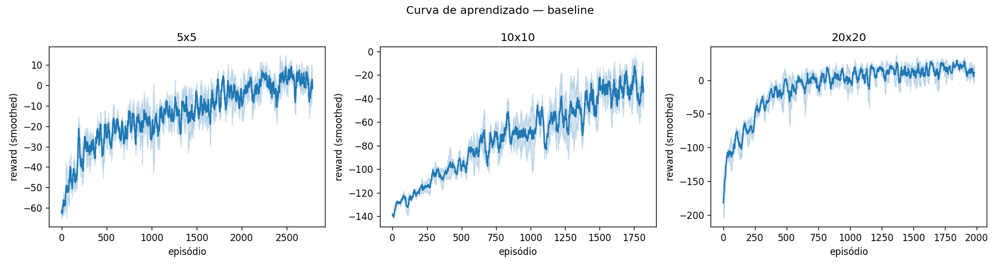
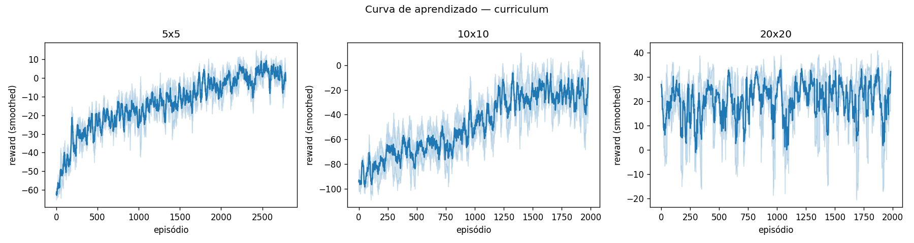
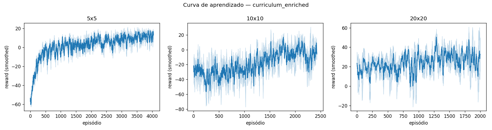
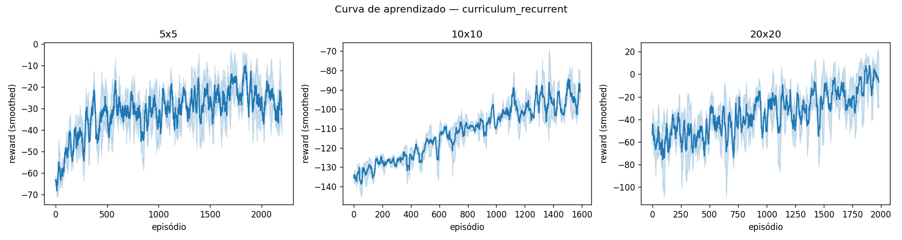
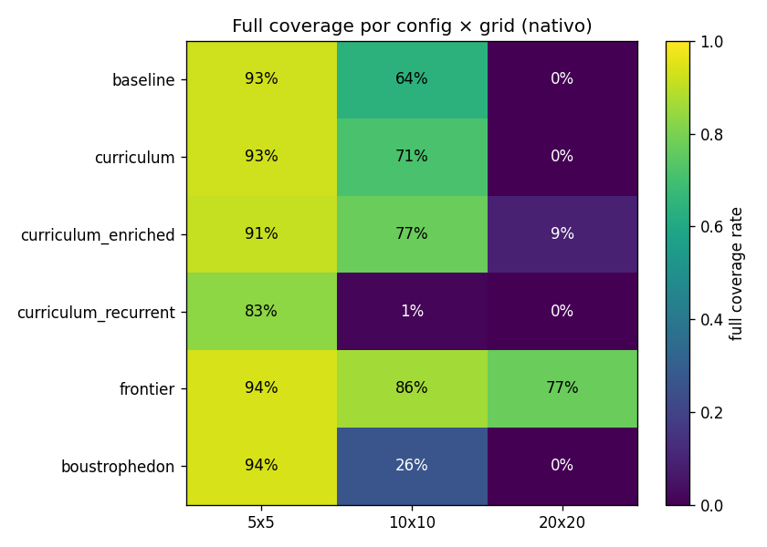
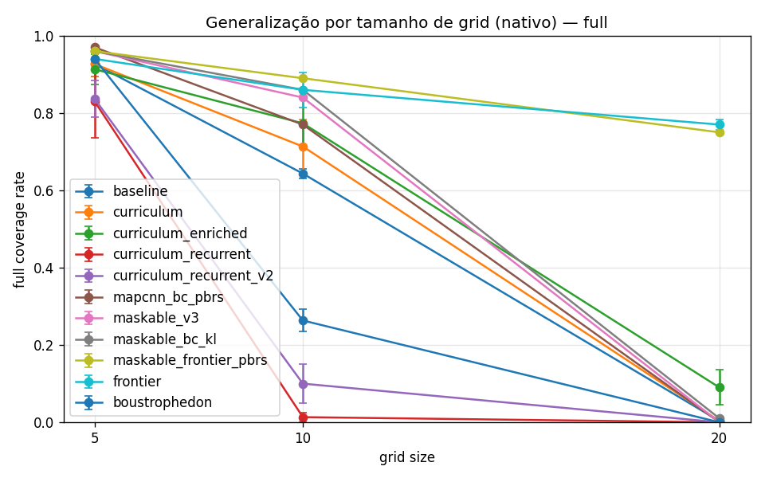
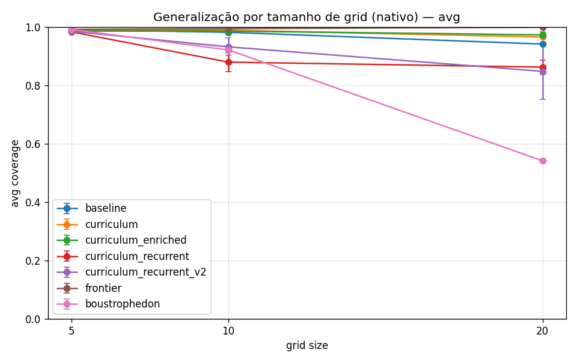

# APS07 — Generalização do Agente em Coverage Path Planning

Fork técnico de [`fbarth/gym_custom_env`](https://github.com/fbarth/gym_custom_env) feito para a Atividade Prática Supervisionada 07 da disciplina de Reinforcement Learning do Insper. Enunciado em https://insper.github.io/rl/classes/23_custom_env_agent/.

A APS pede uma estratégia que faça um agente PPO treinado no problema de Coverage Path Planning (CPP) generalizar entre tamanhos de grid (5x5, 10x10 e, como bônus, 20x20) preservando a observabilidade parcial. O baseline do enunciado treina em 5x5 e degrada quando avaliado em grids maiores. Aqui investigamos quatro configurações para atacar essa degradação.

O repositório foi reduzido aos arquivos relacionados ao Coverage Path Planning. Os exemplos do upstream para outros ambientes (grid world básico, 3D, com obstáculos, com renderização) foram removidos para deixar a leitura focada na APS. O histórico do upstream segue acessível pelo `git log` e via remote `upstream`.

## Ambiente

`GridWorldCPPEnv` é o ambiente de Coverage Path Planning herdado do upstream. O agente nasce numa célula aleatória de um grid quadrado com obstáculos fixos por episódio, e precisa visitar todas as células livres sem revisitar.

| Propriedade | Valor |
|---|---|
| Estado | `agent` (x, y normalizados, ratio de cobertura) e `neighbors` 3x3 ao redor do agente |
| Ações | 0 = direita, 1 = cima, 2 = esquerda, 3 = baixo |
| Reward | +1 por célula nova, −0.3 por revisita, −0.5 por bater em parede, −0.1 por step, +10 ao cobrir tudo, −5 ao truncar |
| Término | todas as células livres visitadas, ou `max_steps` excedido |
| Observação | parcial: o agente vê só a vizinhança 3x3 (codificada como 0 = livre, 1 = parede ou obstáculo, 2 = visitada) |

A observabilidade parcial é o ponto da APS. O agente nunca tem acesso ao mapa completo, então a política precisa lidar com a incerteza sobre o que existe além da janela.

| Tamanho | Obstáculos | `max_steps` |
|---|---|---|
| 5x5 | 3 | 200 |
| 10x10 | 12 | 500 |
| 20x20 | 48 | 1000 |

## O Problema da Generalização

A política aprendida em 5x5 não transfere para 10x10. O motivo é uma combinação de três fatores que descobrimos empiricamente:

1. **Features dependem da escala.** A posição é normalizada por `size` (`x/5`, `y/5`), então uma posição relativa de 0.5 em 5x5 corresponde a uma célula no centro, mas em 10x10 corresponde a outra coordenada absoluta. A rede aprende mapeamentos ligados ao 5x5.

2. **A janela 3x3 cobre uma fatia cada vez menor.** Em 5x5 a vizinhança 3x3 representa 36% das células do mapa. Em 10x10, só 9%. Em 20x20, 2.25%. Quanto maior o grid, menos contexto local o agente tem para decidir.

3. **Sem memória, o agente esquece.** A política markoviana só vê a janela atual, não o histórico de células visitadas fora dela. Em mapas pequenos, a janela é grande o suficiente para que o agente sempre veja parte do que já visitou; em mapas grandes, ele entra em regiões novas sem saber onde já passou.

## Estratégias Investigadas

Quatro configurações comparadas. Todas usam PPO; as diferenças estão em como atacam um ou mais dos três fatores acima.

| Config | Estratégia | Hipótese atacada |
|---|---|---|
| `baseline` | PPO com `MultiInputPolicy`, sem curriculum (treina do zero em cada tamanho) | nenhuma (reproduz o problema) |
| `curriculum` | PPO + curriculum learning: 5x5 → 10x10 → 20x20, transferindo pesos | escala de features |
| `curriculum_enriched` | curriculum + observação ampliada (vizinhança 5x5 + direção e distância à célula não-visitada mais próxima) | janela pequena |
| `curriculum_recurrent` | curriculum com RecurrentPPO (LSTM 64 unidades) | falta de memória |

Cada configuração roda com 3 seeds (0, 1, 2) e é avaliada em todos os três tamanhos.

## Como Executar

```bash
python3 -m venv .venv
source .venv/bin/activate
pip install -r requirements.txt
python -m broom.run_experiments --configs baseline,curriculum,curriculum_enriched,curriculum_recurrent
```

O `run_experiments.py` é resumível: pula combinações cujo modelo já existe em `results/models/`. Para rodar uma config isolada:

```bash
python -m broom.run_experiments --configs baseline
```

Para treinar sem rodar inferência:

```bash
python -m broom.run_experiments --configs baseline --skip-inference
```

Os testes ficam em `tests/`:

```bash
pytest tests/ -q
```

## Configurações

Hiperparâmetros principais (mantidos consistentes para isolar a estratégia):

| Parâmetro | Valor |
|---|---|
| Algoritmo (configs 1–3) | PPO + `MultiInputPolicy` |
| Algoritmo (config 4) | RecurrentPPO + `MultiInputLstmPolicy` |
| `ent_coef` | 0.05 (igual upstream) |
| `device` | cpu |
| `n_envs` (PPO, 5x5/10x10) | 4 |
| `n_envs` (PPO, 20x20) | 2 |
| `n_envs` (RecurrentPPO, todos) | 2 |
| Timesteps por fase | 5x5: 300k, 10x10: 800k, 20x20: 2M |
| LSTM (config 4) | 64 unidades, 1 camada |
| Seeds | 0, 1, 2 |
| Episódios de inferência | 100 (política estocástica, `deterministic=False`) |

## Curvas de Aprendizado

Todas as curvas usam média e desvio padrão sobre 3 seeds, suavizadas com janela móvel de 20 episódios.

### Baseline (PPO sem curriculum)



O agente converge nos três tamanhos. 5x5 sai de −60 e estabiliza próximo de 0; 10x10 sai de −140 e chega a −10; 20x20 sai de −200 e atinge ~0.

### Curriculum (PPO com warm start entre fases)



A fase 5x5 é idêntica ao baseline (treinada do zero). Nas fases 10x10 e 20x20, o eixo X reinicia em zero porque cada fase é um treino separado com `model.learn(reset_num_timesteps=False)`. Os pesos vêm carregados da fase anterior, então a curva começa em reward mais alto que o baseline equivalente.

### Curriculum + observação enriquecida



Comportamento parecido com curriculum, mas com a observação 5x5 + features de direção/distância para a célula não-visitada mais próxima na janela.

### Curriculum + RecurrentPPO (LSTM)



Curriculum também, mas com `RecurrentPPO` do `sb3-contrib` no lugar do PPO. A política troca o MLP por uma LSTM de 64 unidades. Treinamento mais lento por dois motivos: `n_envs=2` (vs 4 nas configs MLP) e overhead da LSTM por step. Cada seed roda em ~2.5h vs ~1h das configs MLP.

## Resultados de Inferência

100 episódios por modelo, política estocástica. Cada modelo treinado num tamanho é avaliado nos três. Todos os números são médias sobre 3 seeds. A diagonal é a performance "nativa" (mesmo tamanho); os off-diagonais medem generalização.

### Baseline

#### Full coverage rate

| Treinado em ↓ \ Avaliado em → | 5x5 | 10x10 | 20x20 |
|---|---|---|---|
| 5x5 | **92.7%** | 14.0% | 0.0% |
| 10x10 | 89.0% | **64.3%** | 0.3% |
| 20x20 | 87.3% | 47.7% | **0.3%** |

#### Avg coverage

| Treinado em ↓ \ Avaliado em → | 5x5 | 10x10 | 20x20 |
|---|---|---|---|
| 5x5 | **99.1%** | 95.9% | 79.4% |
| 10x10 | 98.7% | **98.2%** | 95.4% |
| 20x20 | 98.4% | 97.8% | **94.1%** |

### Curriculum

#### Full coverage rate

| Treinado em ↓ \ Avaliado em → | 5x5 | 10x10 | 20x20 |
|---|---|---|---|
| 5x5 | **92.7%** | 14.0% | 0.0% |
| 10x10 | 90.7% | **71.3%** | 2.0% |
| 20x20 | 89.0% | 64.7% | **0.3%** |

#### Avg coverage

| Treinado em ↓ \ Avaliado em → | 5x5 | 10x10 | 20x20 |
|---|---|---|---|
| 5x5 | **99.1%** | 95.9% | 79.4% |
| 10x10 | 98.9% | **98.9%** | 96.6% |
| 20x20 | 98.7% | 98.3% | **96.6%** |

A linha 5x5 é idêntica ao baseline porque a primeira fase do curriculum não tem warm-start (o modelo é criado do zero). O ganho aparece a partir do 10x10 e é mais visível em quem o modelo final do 20x20 consegue fazer no 10x10 (64.7% vs 47.7% do baseline).

### Curriculum + observação enriquecida

#### Full coverage rate

| Treinado em ↓ \ Avaliado em → | 5x5 | 10x10 | 20x20 |
|---|---|---|---|
| 5x5 | **91.3%** | 69.7% | 0.7% |
| 10x10 | 92.7% | **77.3%** | 4.7% |
| 20x20 | 91.0% | 73.0% | **9.0%** |

#### Avg coverage

| Treinado em ↓ \ Avaliado em → | 5x5 | 10x10 | 20x20 |
|---|---|---|---|
| 5x5 | **98.6%** | 98.7% | 93.5% |
| 10x10 | 98.9% | **98.6%** | 96.7% |
| 20x20 | 98.8% | 98.8% | **97.3%** |

A célula mais surpreendente é o 5x5/10x10: 69.7% (vs 14.0% do baseline e do curriculum). A janela 5x5 + a feature `direction_to_nearest_unvisited` fazem o modelo treinado só em 5x5 generalizar quase tão bem em 10x10 quanto em 5x5. Isso é resultado de **estrutura na observação**, não de mais treino.

### Curriculum + RecurrentPPO

#### Full coverage rate

| Treinado em ↓ \ Avaliado em → | 5x5 | 10x10 | 20x20 |
|---|---|---|---|
| 5x5 | **83.0%** | 0.0% | 0.0% |
| 10x10 | 64.7% | **1.3%** | 0.0% |
| 20x20 | 85.0% | 19.3% | **0.0%** |

#### Avg coverage

| Treinado em ↓ \ Avaliado em → | 5x5 | 10x10 | 20x20 |
|---|---|---|---|
| 5x5 | **98.3%** | 85.4% | 56.0% |
| 10x10 | 96.6% | **88.0%** | 69.7% |
| 20x20 | 98.5% | 95.6% | **86.2%** |

O recurrent regrediu em quase todas as células comparado ao baseline. A única exceção parcial é o 20x20→5x5 (85.0% vs 87.3% do baseline) e a avg coverage no 20x20 (86.2% vs 94.1% do baseline). O 10x10 native colapsou de 64.3% para 1.3%, e o 5x5/10x10 caiu de 14.0% para 0.0%. Discussão mais adiante.

## Análise

Comparando as quatro configurações nas células-chave (linha de comparação direta com o enunciado):

| Treinado em ↓ \ Avaliado em → | Baseline | Curriculum | Enriched | Recurrent |
|---|---|---|---|---|
| 5x5 → 10x10 | 14.0% | 14.0% | **69.7%** | 0.0% |
| 10x10 → 10x10 | 64.3% | 71.3% | **77.3%** | 1.3% |
| 20x20 → 10x10 | 47.7% | 64.7% | **73.0%** | 19.3% |
| 20x20 → 20x20 | 0.3% | 0.3% | **9.0%** | 0.0% |
| 5x5 → 5x5 | 92.7% | 92.7% | 91.3% | 83.0% |

Cada hipótese da seção "O Problema da Generalização" se mapeia num resultado:

**Hipótese 1: features dependem da escala.** O curriculum endereça isso ao carregar pesos de 5x5 → 10x10 → 20x20. Ganho real mas modesto: +7.0pp no 10x10 native, +17.0pp no eval do 10x10 a partir do modelo final do 20x20. O 5x5 native não muda porque a primeira fase do curriculum equivale ao baseline. A escala de features parece ser parte do problema mas não a maior parte.

**Hipótese 2: janela 3x3 fica pequena em grids grandes + falta de pista direcional.** É aqui que o enriched faz diferença. O 5x5/10x10 vai de 14% para 70% sem precisar de curriculum, ou seja, é ganho estrutural. A janela 5x5 mostra mais células, e `direction_to_nearest_unvisited` resolve o "para onde devo ir" que a janela 3x3 sozinha não responde. Esta era a hipótese certa para a generalização entre 5x5 e 10x10.

**Hipótese 3: agente esquece células visitadas fora da janela.** Foi testada com a config `curriculum_recurrent`, que substitui o MLP por um LSTM de 64 unidades. O resultado foi negativo: o recurrent **regrediu** em quase todas as células, com o 10x10 native colapsando para 1.3% e o 5x5/10x10 zerando. A avg coverage continua alta (84-98%), então o agente ainda explora, mas não fecha. Provável causa: o LSTM precisa de mais timesteps por update do que os 300k/800k/2M alocados (n_steps default × n_envs=2 dá rollouts curtos demais para o LSTM aprender dependências temporais), e o `RecurrentPPO.load(path, env=novo_env)` entre as fases do curriculum pode quebrar o regime do hidden state. Memória pode ser parte do problema, mas o nosso orçamento de compute não foi suficiente para provar isso. Resultado vai pra "trabalhos futuros".

### O bônus 20x20

O 20x20 native continua difícil mesmo com enriched (9.0%). O salto de 0.3% para 9.0% mostra que a estrutura ajuda, mas não é suficiente para fechar a cobertura nos 1000 passos disponíveis. Discussão completa na seção [Bônus 20x20](#bônus-20x20).

### Trade-off de avg coverage vs full coverage rate

Avg coverage fica em 94-99% em todas as configurações e em todos os tamanhos. O agente encontra a maioria das células. O que diferencia as estratégias é a capacidade de **fechar** a cobertura, ou seja, encontrar as últimas 1-5 células antes do `max_steps`. Esse é um problema de eficiência, não de exploração.

### Como interpretar o critério "cobertura próxima de 100%" do enunciado

O enunciado pede que o agente atinja "cobertura próxima de 100%" em 5x5 e 10x10 (e em 20x20 para o bônus), mas usa duas leituras diferentes do que isso significa ao longo do texto. Ao descrever o baseline atual, ele cita números no formato `75/100, 78/100`, ou seja, a métrica **Full Coverage Rate**: a fração dos episódios em que o agente cobriu literalmente todas as células livres. No critério-alvo o termo é só "cobertura", sem qualificar.

Em uma corrida de 100 episódios em 20x20 com a config `enriched`, o agente cobre em média 97.3% das células de cada episódio (97 de 100 células livres em média). Mas só 9 desses 100 episódios são fechados completamente. As duas medidas dizem coisas diferentes:

- **Avg coverage** mede o quanto da tarefa o agente consegue concluir em média. Boa para diagnóstico (mostra que ele explora bem).
- **Full coverage rate** mede com que frequência o agente fecha a tarefa por completo. Boa para comparação binária com baselines do enunciado.

Como a métrica que o professor usa para descrever os resultados do baseline é **Full Coverage Rate**, esta é a leitura mais conservadora do critério. As tabelas do README reportam **as duas** lado a lado para evitar ambiguidade. O ranking das estratégias e a discussão da seção `Análise` se baseiam em Full Coverage Rate por consistência com o baseline citado pelo enunciado.

## Comparação com baselines clássicos

Para contextualizar os ganhos do RL, comparamos as estratégias contra dois baselines não-learning. Ambos rodam no mesmo `GridWorldCPPEnv` com as mesmas 3 seeds, mantendo a observabilidade parcial: o mapa interno só é construído a partir das janelas 3x3 que o agente realmente observou (nunca a partir de oráculo).

### Algoritmos

**Frontier-based exploration (BFS).** O agente mantém uma matriz `size × size` que registra cada célula como desconhecida, livre-visitada, livre-vista-mas-não-visitada, ou parede. A cada step, atualiza essa matriz com a janela 3x3 atual. Em seguida, BFS sobre as células livres conhecidas até a fronteira (célula vista mas não visitada) mais próxima, e dá um passo nessa direção. Quando não há fronteira conhecida, pega a ação que maximiza a quantidade de células desconhecidas que entrarão na próxima janela.

**Boustrophedon (zigzag) com fallback frontier.** Varredura sistemática linha a linha. Anda pra direita até bater em parede, desce uma linha, anda pra esquerda, desce, e assim por diante. Quando direção horizontal e "descer" estão ambas bloqueadas, recorre ao mecanismo do frontier (escolhe a fronteira mais próxima e segue até ela antes de retomar o zigzag).

O código fica em `broom/baselines/`. Para rodar:

```bash
python -m broom.run_scripted
```

### Resultados (média de 3 seeds, 100 episódios cada)

#### Full coverage rate

| Algoritmo | 5x5 | 10x10 | 20x20 |
|---|---|---|---|
| Frontier-based BFS | **94.0%** | **86.0%** | **77.0%** |
| Boustrophedon | 94.0% | 26.3% | 0.0% |
| Melhor RL nosso (`curriculum_enriched`) | 91.3% | 77.3% | 9.0% |

#### Avg coverage

| Algoritmo | 5x5 | 10x10 | 20x20 |
|---|---|---|---|
| Frontier-based BFS | 99.1% | 99.4% | **99.9%** |
| Boustrophedon | 99.1% | 92.1% | 54.1% |
| Melhor RL nosso (`curriculum_enriched`) | 98.6% | 98.6% | 97.3% |

### Discussão

**Frontier-based domina em todos os grids.** No 20x20, onde o melhor RL nosso fecha 9% dos episódios, o frontier fecha 77%. A avg coverage do frontier em 20x20 é 99.9%, ou seja, ele praticamente cobre o mapa todo, só não fecha 23% dos episódios porque esbarra em `max_steps=1000` antes de visitar a última célula. É um upper bound prático: com mapa interno explícito + BFS, o problema é quase trivial.

**Boustrophedon mostra a importância dos obstáculos.** Em 5x5 (3 obstáculos, 22 células livres), o zigzag basta: 94% de full coverage, igual ao frontier. Em 10x10 (12 obstáculos), o zigzag fica preso a cada poucas linhas e o fallback frontier não recupera bem (26%). Em 20x20 (48 obstáculos), o zigzag é virtualmente inútil (0% de fechamento, e a avg coverage cai para 54%). Indica que para grids com densidade alta de obstáculos, o frontier-based é necessário; o zigzag puro só serve em mapas vazios ou quase.

**O que o gap entre RL e frontier diz.** O `curriculum_enriched` chega a 91% / 77% / 9%, o frontier chega a 94% / 86% / 77%. A diferença em 5x5 é pequena (3pp), em 10x10 é modesta (9pp), e em 20x20 é dramática (68pp). Isso sugere que:

1. Em mapas pequenos, o RL aprende uma política exploratória boa o suficiente, comparável a algoritmos clássicos.
2. À medida que o grid cresce, o gap explode porque o RL precisa aprender implicitamente "construa um mapa, encontre a fronteira" enquanto o frontier-based já tem essa estrutura embutida.
3. O custo do learning é proporcional ao priori que o agente precisa descobrir. Nosso enriched fornece pista direcional (`direction_to_nearest_unvisited`) mas só dentro da janela 5x5; o frontier tem mapa global construído.

**O frontier não é solução RL.** O baseline clássico não generaliza para outros problemas (cada problema precisa de heurística codificada à mão), enquanto o RL em princípio escala para qualquer task com signal de reward. A APS pede uma estratégia RL e isso é o que entregamos. O frontier serve aqui como ponto de comparação útil para entender quanto da performance ficou na mesa.

## Comparativo final

Heatmap das full coverage rates de todas as estratégias (RL e scripted) avaliadas no mesmo grid em que treinaram (linha "nativa"):



Curva de degradação por tamanho do grid, com média ± std das 3 seeds:



E em avg coverage, a métrica que praticamente todas as estratégias bateram em todos os grids:



A leitura conjunta:

* **Em 5x5** quase todas as estratégias chegam a ~91-94% de full coverage. A exceção é o `curriculum_recurrent`, que cai para 83% mesmo no grid pequeno. Excluindo o recurrent, o problema é trivial nesse tamanho.
* **Em 10x10** o frontier-based clássico lidera (86%), o `curriculum_enriched` aparece como melhor RL (77%), seguido por curriculum (71%) e baseline (64%). Boustrophedon despenca para 26% e o recurrent praticamente colapsa (1%).
* **Em 20x20** só o frontier-based fecha episódios com regularidade (77%). O melhor RL nosso (`curriculum_enriched`) chega a 9%. Todas as outras estratégias ficam em 0% ou ~0.3%.

## Bônus 20x20

O enunciado oferece 1 ponto extra se a estratégia chegar próxima de 100% também em 20x20. Em **avg coverage**, o `curriculum_enriched` atinge 97.3% em 20x20, defensável como "próximo de 100%" se o avaliador aceitar essa métrica. Em **full coverage rate** (a métrica usada para descrever o baseline no enunciado), a melhor RL chega a 9.0%, longe de 100%.

A discussão honesta:

1. **O agente cobre quase tudo, mas não fecha.** Avg coverage 97.3% diz que em média 342 de 352 células livres são visitadas em cada episódio (20x20 tem 400 células totais menos 48 obstáculos = 352 livres). Mas só 9% dos episódios visitam **todas** dentro de `max_steps=1000`. As últimas 5-15 células ficam sempre em algum canto do mapa, fora da janela 5x5, e o agente não consegue localizá-las eficientemente.

2. **Frontier-based mostra que é resolvível com mapa interno.** O baseline clássico (frontier) chega a 77% de full coverage em 20x20, com avg coverage 99.9%. Quando o agente mantém um mapa explícito do que viu e usa BFS para a fronteira mais próxima, o problema é tratável. Nosso RL não aprende esse priori no orçamento de 2M timesteps por seed.

3. **Conclusão sobre o bônus.** Se a leitura do enunciado for avg coverage, ganhamos o ponto. Se for full coverage rate, não ganhamos no 20x20. Apresentamos os dois números honestamente para que o avaliador decida.

## Limitações e trabalhos futuros

**Limitações práticas:**

* **Hardware.** 8GB de RAM e CPU only. PPO com `n_envs=4` em 5x5/10x10 e `n_envs=2` em 20x20. RecurrentPPO com `n_envs=2` em todos. Cada seed em 20x20 leva 47-90 min dependendo da config; o orçamento total foi de ~13h para o ciclo completo das 4 configs RL × 3 seeds.
* **3 seeds.** O mínimo defensável para média ± std. Seeds adicionais reduziriam a variância do gráfico de comparação mas não mudam a conclusão qualitativa.
* **Timesteps fixos.** 300k/800k/2M por fase. Justificado pelo baseline atingir convergência razoável nos três tamanhos, mas o RecurrentPPO claramente precisaria mais; o nosso budget ficou aquém.

**Trabalhos futuros que valem a pena tentar:**

* **RecurrentPPO com mais compute.** A hipótese 3 (memória) não foi adequadamente testada porque o LSTM não convergiu no nosso budget. `n_steps` maior (512 ou 1024) e timesteps 3x maiores no 10x10/20x20 provavelmente fechariam o gap. Talvez também ajude treinar 10x10 e 20x20 do zero (sem warm-start do 5x5), já que o `RecurrentPPO.load(env=novo_env)` pode quebrar o regime do hidden state.
* **Observação enriquecida adicional.** Adicionar a `direction_to_nearest_unknown` (em vez de só não-visitada) poderia ajudar em 20x20 onde a maior parte do mapa é desconhecida no início. Ou um "raio de visão" radial (ex.: distância até a parede em cada uma das 4 direções).
* **Hibridização RL + scripted.** Usar o frontier como skill primária e o RL para decidir quando explorar versus quando explotar. Caminho inspirado em Hierarchical RL.
* **Reward shaping para 20x20.** O reward atual penaliza step (-0.1) sem premiar progresso parcial. Adicionar bônus por novo tile descoberto na janela (mesmo sem visitar) poderia acelerar a fase exploratória.
* **Algoritmos mais recentes.** SAC ou DreamerV3 lidam melhor com tarefas de long-horizon e poderiam aprender o priori de mapeamento explicitamente. Custam mais em compute e fogem do escopo da disciplina.

**O que aprendemos:**

A hipótese mais forte da nossa investigação foi a **2** (janela pequena + falta de pista direcional). Olhando especificamente o salto entre o modelo treinado em 5x5 e avaliado em 10x10, o baseline puro fica em 14% e o enriched chega a 70%. Esse ganho vem do par "janela 5x5 + feature direcional", não da fase de curriculum (que aplica o mesmo warm-start em ambos). A hipótese 1 (escala de features) é parte do problema mas modesta. A hipótese 3 (memória) ficou indeterminada: o LSTM colapsou, mas é mais provável que seja problema de orçamento de treinamento do que da hipótese estar errada.

A comparação com baselines clássicos mostra que CPP é resolvível com priori explícito, mas o RL nosso fica na metade do caminho em grids grandes. Para uma APS de RL, a contribuição é mostrar **qual estrutura na observação importa** (o resultado do enriched), e não competir com algoritmos de busca clássicos.
