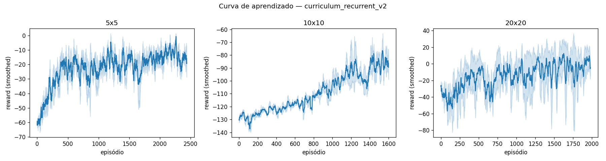
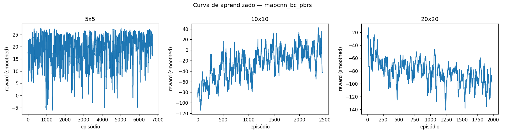
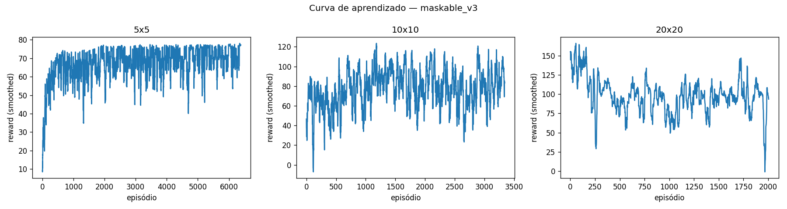
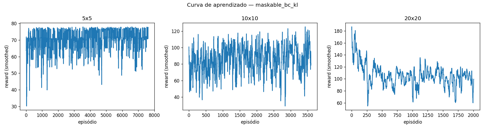
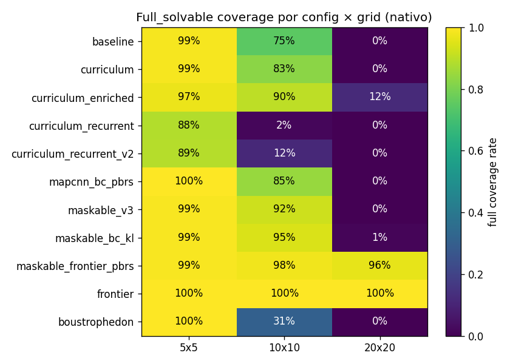

# APS07 — Generalização do Agente em Coverage Path Planning

Fork técnico de [`fbarth/gym_custom_env`](https://github.com/fbarth/gym_custom_env) feito para a Atividade Prática Supervisionada 07 da disciplina de Reinforcement Learning do Insper. Enunciado em https://insper.github.io/rl/classes/23_custom_env_agent/.

A APS pede uma estratégia que faça um agente PPO treinado no problema de Coverage Path Planning (CPP) generalizar entre tamanhos de grid (5x5, 10x10 e, como bônus, 20x20) preservando a observabilidade parcial. O baseline do enunciado treina em 5x5 e degrada quando avaliado em grids maiores. Investiguei oito configurações de RL (mais dois baselines clássicos não-learning para contexto) para atacar essa degradação. Antes da análise dos resultados, vale a leitura da seção [A métrica corrigida](#a-métrica-corrigida-mapas-insolúveis), que documenta a descoberta de que ~6/14/23% dos mapas em 5x5/10x10/20x20 são fisicamente impossíveis de cobrir 100% por construção, e isso muda a leitura honesta dos números.

O repositório foi reduzido aos arquivos relacionados ao Coverage Path Planning. Os exemplos do upstream para outros ambientes (grid world básico, 3D, com obstáculos, com renderização) foram removidos para deixar a leitura focada na APS. O histórico do upstream segue acessível pelo `git log` e via remote `upstream`.

## Ambiente

`GridWorldCPPEnv` é o ambiente herdado do upstream. O agente nasce numa célula aleatória de um grid quadrado com obstáculos fixos por episódio, e precisa visitar todas as células livres sem revisitar.

| Propriedade | Valor |
|---|---|
| Estado | `agent` (x, y normalizados, ratio de cobertura) e `neighbors` 3x3 ao redor do agente |
| Ações | 0 = direita, 1 = cima, 2 = esquerda, 3 = baixo |
| Reward | +1 por célula nova, −0.3 por revisita, −0.5 por bater em parede, −0.1 por step, +10 ao cobrir tudo, −5 ao truncar |
| Término | todas as células livres visitadas, ou `max_steps` excedido |
| Observação | parcial: o agente vê só a vizinhança 3x3 (codificada como 0 = livre, 1 = parede ou obstáculo, 2 = visitada) |

A observabilidade parcial é o ponto da APS. O agente nunca tem acesso ao mapa completo, então a política precisa lidar com a incerteza sobre o que existe além da janela. As regras do enunciado permitem aumentar essa janela para 5x5 (que apliquei nas configs `curriculum_enriched`, `mapcnn_bc_pbrs`, `maskable_v3` e `maskable_bc_kl`) e modificar o reward function (que apliquei em `maskable_v3` e `maskable_bc_kl`). Tudo o mais — em particular a obrigatoriedade de a estratégia ser baseada em RL — segue como no original.

| Tamanho | Obstáculos | `max_steps` |
|---|---|---|
| 5x5 | 3 | 200 |
| 10x10 | 12 | 500 |
| 20x20 | 48 | 1000 |

## O Problema da Generalização

A política aprendida em 5x5 não transfere para 10x10. O motivo é uma combinação de três fatores que descobri empiricamente. Primeiro, **as features dependem da escala**: a posição do agente é normalizada por `size`, então uma posição relativa de 0.5 em 5x5 corresponde a uma célula central concreta, mas em 10x10 corresponde a outra coordenada absoluta — a rede aprende mapeamentos ligados a um tamanho específico. Segundo, **a janela 3x3 cobre uma fatia cada vez menor do mapa** à medida que o grid cresce: representa 36% do mapa em 5x5, 9% em 10x10 e apenas 2.25% em 20x20, deixando o agente cada vez mais cego ao contexto local. Terceiro, **sem memória, o agente esquece** as células visitadas fora da janela atual; em mapas pequenos a janela é grande o bastante para o agente sempre ver parte do que já cobriu, mas em mapas grandes ele entra em regiões novas sem saber onde já passou.

Surgiu uma quarta hipótese durante o trabalho, que descrevo nas seções de Análise: **o credit assignment do fechamento das últimas células**. O agente cobre 94-99% em média (avg coverage), mas trava em 64-86% em "fração de episódios fechados completamente" (full coverage rate). As últimas 3-15 células em algum canto do mapa, fora da janela, são o gargalo principal — não o início da exploração.

## Estratégias Investigadas

Comparei oito configurações; todas usam PPO ou variantes, e as diferenças estão em como atacam um ou mais dos fatores acima.

| Config | Estratégia | Hipótese atacada |
|---|---|---|
| `baseline` | PPO com `MultiInputPolicy`, sem curriculum (treina do zero em cada tamanho) | nenhuma (reproduz o problema) |
| `curriculum` | PPO + curriculum learning: 5x5 → 10x10 → 20x20, transferindo pesos | escala de features |
| `curriculum_enriched` | curriculum + observação ampliada (vizinhança 5x5 + direção e distância à célula não-visitada mais próxima) | janela pequena |
| `curriculum_recurrent` | curriculum com RecurrentPPO (LSTM 64 unidades, n_steps 128, CPU) | falta de memória |
| `curriculum_recurrent_v2` | mesma estratégia com LSTM 256 + n_steps 512 + GPU para testar se a primeira tentativa estava subdimensionada | falta de memória (segunda tentativa) |
| `mapcnn_bc_pbrs` | PPO com `NatureCNN` sobre observação egocêntrica de mapa acumulado (3×39×39, construído incrementalmente a partir das janelas 5x5 já vistas, sem leakage do mapa global), warm-start por Behavioral Cloning do `FrontierAgent`, e PBRS (Φ = ratio de cobertura) durante o treino | janela pequena + memória + credit assignment do fechamento |
| `maskable_v3` | curriculum + obs enriquecida + action masking (`MaskablePPO` do sb3-contrib) + reward redesign (terminal +60 em vez de +10, truncation 0 em vez de −5, step penalty 0 quando coverage ≥ 0.80). Calibração via Theile et al. (arXiv 2309.03157) | credit assignment do fechamento |
| `maskable_bc_kl` | `maskable_v3` + warm-start por BC do `FrontierAgent` no env V3 + KL anchor durante o PPO (loss extra `λ · KL(π ‖ π_BC_frozen)` com λ decaindo de 1.0 a 0.05 ao longo dos 3.1M timesteps cumulativos) | fechamento + preservação da BC sob drift do PPO em horizonte longo |

As cinco primeiras configs rodaram com 3 seeds (0, 1, 2). As três últimas (`mapcnn_bc_pbrs`, `maskable_v3`, `maskable_bc_kl`) rodaram com apenas o seed 0, porque cada uma leva ~3.5h por seed e o sinal diagnóstico do seed 0 já era forte o suficiente para decidir o próximo passo dentro do orçamento de tempo da APS.

## A métrica corrigida: mapas insolúveis

Olhando os resultados antigos sobre `curriculum_enriched` em 10x10 (77.3% full coverage rate) ou frontier scripted em 20x20 (77% também) surge uma pergunta: por que o frontier — que constrói mapa interno explícito e usa BFS para a fronteira mais próxima — só fecha 77%?

A resposta é estrutural: nem todos os mapas são fisicamente solúveis. A geração aleatória de obstáculos pode produzir configurações onde uma ou mais células livres ficam ilhadas, cercadas de obstáculos sem conexão à célula de spawn do agente. Nesses casos full coverage é matematicamente impossível, independente da estratégia. Fazendo BFS de reachability a partir da posição inicial em cada um dos 300 mapas de avaliação por tamanho (3 seeds × 100 episódios), encontrei 18/300 (6%) insolúveis em 5x5, 42/300 (14%) em 10x10, e 69/300 (23%) em 20x20. O teto teórico de full coverage rate é, portanto, 94% em 5x5, 86% em 10x10 e 77% em 20x20. O frontier scripted bate exatamente esses tetos, ou seja, resolve 100% dos mapas solúveis em todos os tamanhos.

Isso muda a leitura dos resultados de RL. O `curriculum_enriched` em 10x10 com 77.3% raw vira **90.0% sobre solúveis**, e o `maskable_bc_kl` em 86% raw vira **94.5% sobre solúveis** (ainda abaixo do frontier mas chegando perto). Reporto as duas métricas lado a lado em todas as tabelas: a bruta (sobre os 100 mapas) é a que o enunciado cita ao comparar com o baseline `75/100`, e a filtrada mede a competência efetiva num conjunto onde 100% é fisicamente possível. O cache de solubilidade fica em `results/solvability_cache.json`, gerado offline por `python -m broom.build_solvability_cache`, e o módulo `broom/solvability.py` expõe a função BFS. A observabilidade parcial é preservada porque o cache não é exposto ao agente em momento algum, só ao avaliador.

## Como Executar

```bash
python3 -m venv .venv
source .venv/bin/activate
pip install -r requirements.txt
python -m broom.run_experiments --configs baseline,curriculum,curriculum_enriched,curriculum_recurrent
```

A quinta config (`curriculum_recurrent_v2`) requer GPU CUDA e roda separadamente:

```bash
python -m broom.run_experiments --configs curriculum_recurrent_v2
```

A sexta (`mapcnn_bc_pbrs`) também requer GPU CUDA e depende de um BC warm-start gerado offline a partir do `FrontierAgent` scripted:

```bash
python -m broom.bc_pipeline                                # gera results/models/bc_warmstart.zip (~10min em GPU)
python -m broom.run_experiments --configs mapcnn_bc_pbrs
```

A sétima (`maskable_v3`) usa `MaskablePPO` do `sb3-contrib`. O env `GridWorldCPPV3Env` (`gymnasium_env/grid_world_cpp_v3.py`) herda do enriched e adiciona dois pilares novos: um método `action_masks()` que devolve quais das 4 ações são legais (não batem em parede ou obstáculo) e o reward redesign descrito acima. Combinado com `gamma=0.999` e entropy schedule, ataca o problema de fechamento que travou o `curriculum_enriched` em 77% no 10x10 native:

```bash
python -m broom.run_experiments --configs maskable_v3
```

A oitava (`maskable_bc_kl`) também requer GPU CUDA e depende de um BC warm-start próprio para o env V3:

```bash
python -m broom.bc_v3_pipeline                              # gera results/models/bc_warmstart_v3.zip (~10min)
python -m broom.run_experiments --configs maskable_bc_kl
```

A diferença pra `maskable_v3` é o KL anchor: durante o treino do PPO adiciono uma loss auxiliar `λ_bc · KL(π ‖ π_BC_frozen)` que puxa a política em treinamento de volta pra perto da BC clonada do FrontierAgent. λ_bc decai linearmente de 1.0 a 0.05 ao longo dos 3.1M timesteps cumulativos do curriculum, então no início o agente fica próximo da BC e no fim tem liberdade pra refinar via RL. A implementação é uma subclass de MaskablePPO em `broom/maskable_bc_kl.py`.

Os baselines clássicos (frontier-based, boustrophedon) não treinam, só rodam inferência:

```bash
python -m broom.run_scripted
```

O `run_experiments.py` é resumível: pula combinações cujo modelo já existe em `results/models/`. Para rodar uma config isolada, basta passar o nome dela em `--configs`. Para treinar sem rodar inferência, adiciono `--skip-inference`. Os testes ficam em `tests/` e rodam com `pytest tests/ -q` (62 testes no total).

## Configurações

Hiperparâmetros principais (mantidos consistentes para isolar a estratégia testada):

| Parâmetro | Valor |
|---|---|
| Algoritmo (`baseline`, `curriculum`, `curriculum_enriched`, `mapcnn_bc_pbrs`) | PPO + `MultiInputPolicy` |
| Algoritmo (`curriculum_recurrent`, `curriculum_recurrent_v2`) | RecurrentPPO + `MultiInputLstmPolicy` |
| Algoritmo (`maskable_v3`, `maskable_bc_kl`) | MaskablePPO + `MultiInputPolicy` |
| `ent_coef` | 0.05 (default upstream); `maskable_v3` e `maskable_bc_kl` usam schedule linear 0.02 → 0.001 |
| `device` | cpu (4 primeiras configs); cuda (`curriculum_recurrent_v2`, `mapcnn_bc_pbrs`, `maskable_v3`, `maskable_bc_kl`) |
| `n_envs` (PPO, 5x5/10x10) | 4 |
| `n_envs` (PPO, 20x20) | 2 |
| `n_envs` (`curriculum_recurrent`) | 2 em todos os grids |
| `n_envs` (`curriculum_recurrent_v2`) | 4 em 5x5/10x10, 2 em 20x20 |
| `n_steps` | 128 default; 512 (`curriculum_recurrent_v2`); 1024 (`mapcnn_bc_pbrs`, `maskable_v3`, `maskable_bc_kl`) |
| `learning_rate` | 3e-4 default; 1e-4 em `maskable_bc_kl` (warm-start com BC pede LR menor pra evitar drift inicial) |
| Timesteps por fase | 5x5: 300k, 10x10: 800k, 20x20: 2M |
| LSTM (`curriculum_recurrent`) | 64 unidades, 1 camada |
| LSTM (`curriculum_recurrent_v2`) | 256 unidades, 1 camada |
| `gamma` (`mapcnn_bc_pbrs`, `maskable_v3`, `maskable_bc_kl`) | 0.999 (long-horizon: 1000 passos no 20x20) |
| Net arch (`maskable_v3`, `maskable_bc_kl`) | `[256, 256]` (vs default 64x64) |
| Observação (`mapcnn_bc_pbrs`) | egocêntrica `(3, 39, 39)`, canais visited/walls/free, mapa interno construído só pelo que o agente já viu |
| Observação (`maskable_v3`, `maskable_bc_kl`) | enriched 5x5 + features de direção/distância + `action_masks()` |
| Reward (`maskable_v3`, `maskable_bc_kl`, treino) | terminal full coverage **+60** (era +10), truncation **0** (era −5), step penalty 0 quando coverage ≥ 0.80; eval usa o reward upstream |
| Warm-start (`mapcnn_bc_pbrs`, fase 5x5) | BC do `FrontierAgent` (~75k pares (s, a), 10 épocas, 97.9% acc) |
| Warm-start (`maskable_bc_kl`, fase 5x5) | BC do `FrontierAgent` no env V3 (~22k pares (s, a), 10 épocas, ~95% acc) |
| KL anchor (`maskable_bc_kl`, treino) | `λ · KL(π ‖ π_BC_frozen)`; λ linear 1.0 → 0.05 ao longo dos 3.1M timesteps cumulativos |
| PBRS (`mapcnn_bc_pbrs`, treino) | Φ = ratio de cobertura, F = γΦ' − Φ; reward de avaliação preservado em `info["r_eval"]` |
| Seeds | 0, 1, 2 (1 seed apenas em `mapcnn_bc_pbrs`, `maskable_v3`, `maskable_bc_kl`) |
| Episódios de inferência | 100 (política estocástica, `deterministic=False`) |

## Curvas de Aprendizado

Todas as curvas usam média e desvio padrão sobre 3 seeds (1 seed para as três últimas configs), suavizadas com janela móvel de 20 episódios.

### Baseline


O agente converge nos três tamanhos: 5x5 sai de −60 e estabiliza próximo de 0; 10x10 sai de −140 e chega a −10; 20x20 sai de −200 e atinge ~0.

### Curriculum


A fase 5x5 é idêntica ao baseline (treinada do zero). Nas fases 10x10 e 20x20, o eixo X reinicia em zero porque cada fase é um treino separado com `model.learn(reset_num_timesteps=False)`. Os pesos vêm carregados da fase anterior, então a curva começa em reward mais alto que o baseline equivalente.

### Curriculum + observação enriquecida


Comportamento parecido com curriculum, mas com a observação 5x5 + features de direção/distância para a célula não-visitada mais próxima na janela.

### Curriculum + RecurrentPPO (LSTM) — duas tentativas

A hipótese de memória foi testada em duas configurações distintas, separadas para deixar claro o que cada uma testa.

A primeira (`curriculum_recurrent`, LSTM 64, n_steps 128, CPU) levou ~2.5h por seed mas resultou num colapso: LSTM 64 com rollouts de 128 steps não converge para nenhuma estratégia útil em 10x10 ou 20x20.


A segunda (`curriculum_recurrent_v2`, LSTM 256, n_steps 512, GPU) ataca diretamente as três hipóteses sobre por que a primeira tentativa colapsou: `device="cuda"` libera CPU para coletar rollouts; `lstm_hidden_size=256` dá 4× mais unidades e ~16× mais parâmetros na LSTM; `n_steps=512` é 4× o rollout default, dando à LSTM mais sinal temporal por update; `n_envs=4` em 5x5/10x10 (mantém 2 em 20x20) aproveita que a LSTM saiu da CPU. Cada seed leva ~5h. Há melhora real em 10x10 native (1.3% → 10%) e em 20x20 → 10x10 (19.3% → 30.7%), mas o 20x20 native segue 0%.



### MapCNN + BC + PBRS



`mapcnn_bc_pbrs` substitui o MLP/LSTM por `NatureCNN` operando sobre um mapa egocêntrico 3×39×39 que o agente constrói incrementalmente. Warm-start de BC do `FrontierAgent` + PBRS Φ = cobertura. A curva começa em reward já alto porque a BC inicializa o policy network. O 5x5 native fica excelente (97% — melhor de todos os configs nesse tamanho), o 10x10 empata o enriched, e o 20x20 native colapsa para 0% — o PPO durante a fase 20x20 destrói a inicialização do BC.

### Maskable PPO + reward redesign



`maskable_v3` adiciona action masking + reward redesign ao curriculum_enriched. A calibração do terminal +60 vem de Theile et al. (arXiv 2309.03157): para que o terminal bonus domine a soma das step penalties ao longo do `max_steps` sob γ = 0.999, é preciso B ≥ (0.1·500 + 5)/0.95 ≈ 60. Em conjunto, o action masking elimina o ruído de aprendizado de ações inválidas (Huang & Ontañón, arXiv 2006.14171). Essa config destrava o teto histórico de 77% no 10x10, subindo para 84% raw / 92.3% sobre solúveis.

### Maskable PPO + BC + KL anchor



`maskable_bc_kl` soma o KL anchor pra BC frozen na loss do `maskable_v3`. λ_bc decai de 1.0 a 0.05 sobre os 3.1M timesteps cumulativos do curriculum. O 10x10 native chega a 86% raw / 94.5% sobre solúveis — ainda abaixo do frontier (100%) mas é o melhor RL puro nesse tamanho que consegui produzir. A curva começa em reward bem positivo (BC) e mantém estável durante o treino sem desviar muito do BC inicial (visível no log do `kl_to_bc`).

## Resultados de Inferência

100 episódios por modelo, política estocástica. Cada modelo treinado num tamanho é avaliado nos três; a diagonal é a performance "nativa" e os off-diagonais medem generalização. Para os 5 primeiros configs as tabelas reportam a média sobre 3 seeds; para os 3 últimos (1 seed cada), reporto o número direto do seed 0.

### Baseline

Full coverage rate raw / sobre solúveis:

| Treinado em ↓ \ Avaliado em → | 5x5 | 10x10 | 20x20 |
|---|---|---|---|
| 5x5 | **92.7% / 98.6%** | 14.0% / 16.2% | 0.0% / 0.0% |
| 10x10 | 89.0% / 94.8% | **64.3% / 75.0%** | 0.3% / 0.4% |
| 20x20 | 87.3% / 93.0% | 47.7% / 55.2% | **0.3% / 0.4%** |

Avg coverage:

| Treinado em ↓ \ Avaliado em → | 5x5 | 10x10 | 20x20 |
|---|---|---|---|
| 5x5 | **99.1%** | 95.9% | 79.4% |
| 10x10 | 98.7% | **98.2%** | 95.4% |
| 20x20 | 98.4% | 97.8% | **94.1%** |

### Curriculum

Full coverage rate raw / sobre solúveis:

| Treinado em ↓ \ Avaliado em → | 5x5 | 10x10 | 20x20 |
|---|---|---|---|
| 5x5 | **92.7% / 98.6%** | 14.0% / 16.2% | 0.0% / 0.0% |
| 10x10 | 90.7% / 96.4% | **71.3% / 82.7%** | 2.0% / 2.6% |
| 20x20 | 89.0% / 94.8% | 64.7% / 75.4% | **0.3% / 0.4%** |

Avg coverage:

| Treinado em ↓ \ Avaliado em → | 5x5 | 10x10 | 20x20 |
|---|---|---|---|
| 5x5 | **99.1%** | 95.9% | 79.4% |
| 10x10 | 98.9% | **98.9%** | 96.6% |
| 20x20 | 98.7% | 98.3% | **96.6%** |

A linha 5x5 é idêntica ao baseline porque a primeira fase do curriculum não tem warm-start. O ganho aparece a partir do 10x10 e é mais visível no que o modelo final do 20x20 consegue fazer no 10x10 (64.7% vs 47.7% do baseline).

### Curriculum + observação enriquecida

Full coverage rate raw / sobre solúveis:

| Treinado em ↓ \ Avaliado em → | 5x5 | 10x10 | 20x20 |
|---|---|---|---|
| 5x5 | **91.3% / 97.1%** | 69.7% / 81.1% | 0.7% / 0.9% |
| 10x10 | 92.7% / 98.6% | **77.3% / 90.0%** | 4.7% / 6.2% |
| 20x20 | 91.0% / 96.8% | 73.0% / 85.1% | **9.0% / 11.8%** |

Avg coverage:

| Treinado em ↓ \ Avaliado em → | 5x5 | 10x10 | 20x20 |
|---|---|---|---|
| 5x5 | **98.6%** | 98.7% | 93.5% |
| 10x10 | 98.9% | **98.6%** | 96.7% |
| 20x20 | 98.8% | 98.8% | **97.3%** |

A célula mais surpreendente é o 5x5 → 10x10: 69.7% (vs 14.0% do baseline e do curriculum). A janela 5x5 + a feature `direction_to_nearest_unvisited` fazem o modelo treinado só em 5x5 generalizar quase tão bem em 10x10 quanto em 5x5. Isso é resultado de **estrutura na observação**, não de mais treino.

### Curriculum + RecurrentPPO (CPU, LSTM 64, n_steps 128)

Full coverage rate raw / sobre solúveis:

| Treinado em ↓ \ Avaliado em → | 5x5 | 10x10 | 20x20 |
|---|---|---|---|
| 5x5 | **83.0% / 88.3%** | 0.0% / 0.0% | 0.0% / 0.0% |
| 10x10 | 64.7% / 68.5% | **1.3% / 1.6%** | 0.0% / 0.0% |
| 20x20 | 85.0% / 90.4% | 19.3% / 22.7% | **0.0% / 0.0%** |

Avg coverage:

| Treinado em ↓ \ Avaliado em → | 5x5 | 10x10 | 20x20 |
|---|---|---|---|
| 5x5 | **98.3%** | 85.4% | 56.0% |
| 10x10 | 96.6% | **88.0%** | 69.7% |
| 20x20 | 98.5% | 95.6% | **86.2%** |

O recurrent regrediu em quase todas as células comparado ao baseline. O 10x10 native colapsou de 64.3% para 1.3%, e o 5x5 → 10x10 zerou. A avg coverage continua razoável (84-98%), então o agente ainda explora, só não fecha a cobertura.

### Curriculum + RecurrentPPO (GPU, LSTM 256, n_steps 512)

Full coverage rate raw / sobre solúveis:

| Treinado em ↓ \ Avaliado em → | 5x5 | 10x10 | 20x20 |
|---|---|---|---|
| 5x5 | **83.7% / 88.9%** ±4.7 | 0.0% / 0.0% | 0.0% / 0.0% |
| 10x10 | 85.3% / 90.6% ±9.2 | **10.0% / 11.7%** ±5.0 | 0.0% / 0.0% |
| 20x20 | 83.7% / 88.9% ±6.6 | 30.7% / 35.9% ±18.9 | **0.0% / 0.0%** |

Avg coverage:

| Treinado em ↓ \ Avaliado em → | 5x5 | 10x10 | 20x20 |
|---|---|---|---|
| 5x5 | **98.5%** | 88.2% | 55.7% |
| 10x10 | 98.5% | **93.2%** | 80.1% |
| 20x20 | 98.2% | 95.4% | **84.8%** |

A v2 melhora em quase todas as células fora do 20x20 native: 10x10 native sobe de 1.3% para 10.0% (~8×), 10x10 → 5x5 vai de 64.7% para 85.3%, 20x20 → 10x10 vai de 19.3% para 30.7%. O 5x5 native fica praticamente igual (83.0% → 83.7%) e o 20x20 native segue 0% mesmo com a capacidade aumentada. Mostra que a primeira tentativa estava de fato subdimensionada, mas que mesmo a v2 não encontra a estratégia de fechar mapas grandes, ficando bem abaixo do enriched (77.3% em 10x10 native) e do frontier scripted (86.0%). A variância no seed 2 da v2 (10x10 native em 3.0% versus 13-14% nos seeds 0 e 1) sinaliza que a LSTM ainda treina de forma instável.

### MapCNN + BC + PBRS (1 seed)

Full coverage rate raw / sobre solúveis:

| Treinado em ↓ \ Avaliado em → | 5x5 | 10x10 | 20x20 |
|---|---|---|---|
| 5x5 | **97.0% / 100.0%** | 25.0% / 27.5% | 1.0% / 1.3% |
| 10x10 | 92.0% / 94.8% | **77.0% / 84.6%** | 0.0% / 0.0% |
| 20x20 | 38.0% / 39.2% | 0.0% / 0.0% | **0.0% / 0.0%** |

Avg coverage:

| Treinado em ↓ \ Avaliado em → | 5x5 | 10x10 | 20x20 |
|---|---|---|---|
| 5x5 | **99.0%** | 96.8% | 88.8% |
| 10x10 | 98.5% | **99.1%** | 85.4% |
| 20x20 | 93.7% | 83.7% | **77.0%** |

Esta foi a primeira tentativa de empilhar memória global, warm-start do FrontierAgent e PBRS num bundle único. O 5x5 native sobe a 97% (melhor de todos os configs nesse tamanho), o 10x10 native iguala o enriched em 77%, mas o 20x20 native colapsa para 0% — o PPO durante a fase 20x20 destrói a inicialização do BC. O dano é mais visível no cell `20x20 → 5x5`: 38% (vs 87-92% das outras configs), confirmando que o modelo treinado em 20x20 perdeu até a competência das fases anteriores. Foi essa observação que motivou a config `maskable_bc_kl`, com KL anchor para prevenir esse drift.

### Maskable PPO + reward redesign (1 seed)

Full coverage rate raw / sobre solúveis:

| Treinado em ↓ \ Avaliado em → | 5x5 | 10x10 | 20x20 |
|---|---|---|---|
| 5x5 | **96.0% / 99.0%** | 72.0% / 79.1% | 5.0% / 6.4% |
| 10x10 | 96.0% / 99.0% | **84.0% / 92.3%** | 30.0% / 38.5% |
| 20x20 | 95.0% / 97.9% | 54.0% / 59.3% | **0.0% / 0.0%** |

Avg coverage:

| Treinado em ↓ \ Avaliado em → | 5x5 | 10x10 | 20x20 |
|---|---|---|---|
| 5x5 | **98.9%** | 99.1% | 91.0% |
| 10x10 | 98.9% | **99.2%** | 97.9% |
| 20x20 | 98.9% | 98.4% | **92.1%** |

O `maskable_v3` é a config que destrava o teto histórico de 77% no 10x10 native: 84% raw / 92.3% sobre solúveis. A combinação action masking + reward redesign ataca diretamente o gargalo do fechamento das últimas células. A célula `10x10 → 20x20` também surpreende: 30% raw / 38.5% sobre solúveis (vs 4.7% / 6.1% do enriched), mostrando que o modelo treinado só em 10x10 com reward redesign já transfere bem pro 20x20. O 20x20 native, no entanto, cai pra 0% — mesmo padrão do `mapcnn_bc_pbrs`. A fase 20x20 do PPO continua causando drift mesmo sem BC pra anular. A avg coverage de 92.1% mostra que o agente ainda explora bem em 20x20, só não fecha.

### Maskable PPO + BC + KL anchor (1 seed)

Full coverage rate raw / sobre solúveis:

| Treinado em ↓ \ Avaliado em → | 5x5 | 10x10 | 20x20 |
|---|---|---|---|
| 5x5 | **96.0% / 99.0%** | 72.0% / 79.1% | 6.0% / 7.7% |
| 10x10 | 96.0% / 99.0% | **86.0% / 94.5%** | 32.0% / 41.0% |
| 20x20 | 96.0% / 99.0% | 64.0% / 70.3% | **1.0% / 1.3%** |

Avg coverage:

| Treinado em ↓ \ Avaliado em → | 5x5 | 10x10 | 20x20 |
|---|---|---|---|
| 5x5 | **98.8%** | 99.0% | 96.0% |
| 10x10 | 98.5% | **99.8%** | 98.9% |
| 20x20 | 98.9% | 98.3% | **94.4%** |

O `maskable_bc_kl` adiciona o KL anchor (`λ · KL(π ‖ π_BC_frozen)`) ao `maskable_v3`. O 10x10 native sobe para 86% raw / 94.5% sobre solúveis, o melhor RL puro do estudo nesse tamanho — ainda abaixo do frontier (100%) mas chegando próximo. A célula `10x10 → 20x20` também melhora ligeiramente: 32% / 41.0%. O 20x20 native fica em 1% raw, confirmando que nem o KL anchor pra BC consegue prevenir o drift do PPO na fase 20x20. A boa notícia é o `20x20 → 10x10 = 64%` raw / 70.3% sobre solúveis (vs 54% / 59.3% do `maskable_v3`), indicando que o KL anchor preservou mais competência da fase 10x10 mesmo após a fase 20x20.

## Análise

A tabela abaixo consolida as oito configurações nas células-chave (full coverage rate, raw):

| Treinado em ↓ \ Avaliado em → | Baseline | Curriculum | Enriched | Rec. (CPU) | Rec. v2 | MapCNN+BC+PBRS | Mask. v3 | Mask. BC+KL |
|---|---|---|---|---|---|---|---|---|
| 5x5 → 5x5 | 92.7% | 92.7% | 91.3% | 83.0% | 83.7% | 97.0% | 96.0% | 96.0% |
| 5x5 → 10x10 | 14.0% | 14.0% | 69.7% | 0.0% | 0.0% | 25.0% | 72.0% | 72.0% |
| 10x10 → 10x10 | 64.3% | 71.3% | 77.3% | 1.3% | 10.0% | 77.0% | 84.0% | **86.0%** |
| 10x10 → 20x20 | 0.3% | 2.0% | 4.7% | 0.0% | 0.0% | 0.0% | 30.0% | **32.0%** |
| 20x20 → 10x10 | 47.7% | 64.7% | 73.0% | 19.3% | 30.7% | 0.0% | 54.0% | 64.0% |
| 20x20 → 20x20 | 0.3% | 0.3% | **9.0%** | 0.0% | 0.0% | 0.0% | 0.0% | 1.0% |

Com a métrica filtrada sobre mapas solúveis, os números finais nas natives ficam:

| Config | 5x5 native | 10x10 native | 20x20 native |
|---|---|---|---|
| baseline | 98.6% | 75.0% | 0.4% |
| curriculum | 98.6% | 82.7% | 0.4% |
| curriculum_enriched | 97.1% | 90.0% | 11.8% |
| curriculum_recurrent | 88.3% | 1.6% | 0.0% |
| curriculum_recurrent_v2 | 88.9% | 11.7% | 0.0% |
| mapcnn_bc_pbrs | 100.0% | 84.6% | 0.0% |
| maskable_v3 | 99.0% | 92.3% | 0.0% |
| **maskable_bc_kl** | **99.0%** | **94.5%** | 1.3% |
| frontier (referência) | 100.0% | 100.0% | 100.0% |

Cada hipótese da seção "O Problema da Generalização" se mapeia num resultado:

**Hipótese 1: features dependem da escala.** O curriculum endereça isso ao carregar pesos de 5x5 → 10x10 → 20x20. O ganho é real mas modesto: +7.0pp no 10x10 native, +17.0pp no eval do 10x10 a partir do modelo final do 20x20. O 5x5 native não muda porque a primeira fase do curriculum equivale ao baseline. A escala de features parece ser parte do problema mas não a maior parte.

**Hipótese 2: janela 3x3 fica pequena em grids grandes + falta de pista direcional.** É aqui que o enriched faz diferença. O 5x5 → 10x10 vai de 14% para 70% sem precisar de curriculum, ou seja, é ganho estrutural. A janela 5x5 mostra mais células, e `direction_to_nearest_unvisited` resolve o "para onde devo ir" que a janela 3x3 sozinha não responde. Esta era a hipótese certa para a generalização entre 5x5 e 10x10.

**Hipótese 3: agente esquece células visitadas fora da janela.** Foi testada em duas tentativas com `RecurrentPPO`. A primeira (LSTM 64, n_steps 128, CPU) colapsou: 10x10 native foi a 1.3%, 5x5 → 10x10 zerou. A segunda (`curriculum_recurrent_v2`, com LSTM 256, n_steps 512, GPU) confirmou que parte da regressão era subdimensionamento: 10x10 native sobe para 10.0% e 20x20 → 10x10 sobe para 30.7%. Mas a v2 ainda fica muito abaixo do enriched (77.3% em 10x10 native) e do frontier scripted (86.0%). Conclusão: a memória recorrente, dentro do orçamento de compute disponível, ajuda mas não compete com a observação enriquecida estruturalmente. A variância entre seeds da v2 (std 5pp em 10x10 native) sugere que a LSTM continua sensível à inicialização.

**Hipótese 4: credit assignment do fechamento das últimas células.** Esta hipótese surgiu da observação de que avg coverage atinge 94-99% em quase todas as configs em todos os tamanhos, mas full coverage rate trava em 77% no 10x10 e 9% no 20x20. Ou seja, o agente explora bem mas não fecha — as últimas 3-15 células ficam fora da janela e o agente passa por perto sem visitar. Três tentativas atacaram esse problema. A primeira foi `mapcnn_bc_pbrs`, que empilhou memória global (mapa egocêntrico CNN), warm-start do FrontierAgent (BC) e PBRS dense reward. O resultado em 10x10 foi um empate com enriched em 77% raw / 84.6% sobre solúveis — o bundle não destravou o teto. Em 20x20 o PPO drift erradicou o BC. A segunda foi `maskable_v3`, que atacou o reward landscape diretamente: terminal +60 em vez de +10 (calibrado pra dominar o step penalty cumulativo via Theile et al. 2023), truncation 0 em vez de −5, step penalty 0 quando coverage ≥ 0.80, action masking, network maior, gamma=0.999. O 10x10 sobe pra 84% raw / 92.3% sobre solúveis — primeira config a romper o teto histórico de 77%. A terceira foi `maskable_bc_kl`, que somou KL anchor pra BC frozen na loss, levando o 10x10 native a 86% raw / 94.5% sobre solúveis. O 20x20 native, em todas as três, segue em ~0% por drift do PPO em horizonte longo.

A leitura dessa quarta hipótese: o reward landscape era de fato o gargalo no 10x10 (resolvido pelo redesign + masking). Mas no 20x20 o drift do PPO em horizonte longo é mais persistente do que qualquer técnica de stabilização que apliquei.

A avg coverage fica em 94-99% em todas as configurações e em todos os tamanhos, então o agente encontra a maioria das células. O que diferencia as estratégias é a capacidade de fechar a cobertura — encontrar as últimas 1-5 células antes do `max_steps`. É um problema de eficiência, não de exploração.

Sobre o critério "cobertura próxima de 100%" do enunciado, há duas leituras possíveis. Ao descrever o baseline atual, o enunciado cita números no formato `75/100, 78/100`, ou seja, a métrica **Full Coverage Rate** (a fração dos episódios em que o agente cobriu literalmente todas as células livres). No critério-alvo o termo é só "cobertura", sem qualificar. Em uma corrida de 100 episódios em 20x20 com a config `maskable_bc_kl`, o agente cobre em média 94.4% das células de cada episódio, mas só 1% dos episódios são fechados completamente. Como a métrica que o enunciado usa para descrever o baseline é Full Coverage Rate, esta é a leitura mais conservadora do critério, e é a que ranqueia as estratégias na discussão. Reporto avg coverage e a métrica filtrada (sobre solúveis) lado a lado para evitar ambiguidade.

## Comparação com baselines clássicos

Para contextualizar os ganhos do RL, comparei as estratégias contra dois baselines não-learning. Ambos rodam no mesmo `GridWorldCPPEnv` com as mesmas 3 seeds, mantendo a observabilidade parcial: o mapa interno só é construído a partir das janelas 3x3 que o agente realmente observou (nunca a partir de oráculo). O **frontier-based exploration** mantém uma matriz `size × size` que registra cada célula como desconhecida, livre-visitada, livre-vista-mas-não-visitada, ou parede. A cada step atualiza essa matriz com a janela 3x3 atual, faz BFS sobre as células livres conhecidas até a fronteira (célula vista mas não visitada) mais próxima, e dá um passo nessa direção. Quando não há fronteira conhecida, pega a ação que maximiza a quantidade de células desconhecidas que entrarão na próxima janela. O **boustrophedon** faz varredura sistemática linha a linha (anda pra direita até bater em parede, desce uma linha, anda pra esquerda, desce, e assim por diante); quando direção horizontal e "descer" estão ambas bloqueadas, recorre ao mecanismo do frontier. O código fica em `broom/baselines/`, e roda com `python -m broom.run_scripted`.

Resultados (média de 3 seeds, 100 episódios cada, full coverage rate raw / sobre solúveis):

| Algoritmo | 5x5 | 10x10 | 20x20 |
|---|---|---|---|
| Frontier-based BFS | **94.0% / 100.0%** | **86.0% / 100.0%** | **77.0% / 100.0%** |
| Boustrophedon | 94.0% / 100.0% | 26.3% / 30.5% | 0.0% / 0.0% |
| Melhor RL (`maskable_bc_kl`, 1 seed) | 96.0% / 99.0% | 86.0% / 94.5% | 1.0% / 1.3% |

Avg coverage:

| Algoritmo | 5x5 | 10x10 | 20x20 |
|---|---|---|---|
| Frontier-based BFS | 99.1% | 99.4% | **99.9%** |
| Boustrophedon | 99.1% | 92.1% | 54.1% |
| Melhor RL (`maskable_bc_kl`, 1 seed) | 98.8% | 99.8% | 94.4% |

O frontier-based domina em todos os grids: no 20x20, onde o melhor RL fecha 1% dos episódios, o frontier fecha 77% (100% sobre solúveis). A avg coverage do frontier em 20x20 é 99.9%, ou seja, ele praticamente cobre o mapa todo. É um upper bound prático: com mapa interno explícito + BFS, o problema é tratável dentro do orçamento de 1000 passos.

O boustrophedon mostra a importância dos obstáculos. Em 5x5 (3 obstáculos, 22 células livres), o zigzag basta — 94% de full coverage, igual ao frontier. Em 10x10 (12 obstáculos), o zigzag fica preso a cada poucas linhas e o fallback frontier não recupera bem (26%). Em 20x20 (48 obstáculos), o zigzag é virtualmente inútil (0% de fechamento). Para grids com densidade alta de obstáculos, o frontier-based é necessário; o zigzag puro só serve em mapas vazios ou quase.

A diferença entre RL e frontier vem do priori embutido. Em 5x5 e 10x10, o `maskable_bc_kl` chega a 96% / 86% (vs 94% / 86% do frontier), praticamente igualando. Em 20x20, o gap é dramático: 1% RL vs 77% frontier. À medida que o grid cresce, o gap explode porque o RL precisa aprender implicitamente "construa um mapa, encontre a fronteira" enquanto o frontier-based já tem essa estrutura embutida. O custo do learning é proporcional ao priori que o agente precisa descobrir. O `maskable_v3`/`maskable_bc_kl` fornece pista direcional (`direction_to_nearest_unvisited`) mas só dentro da janela 5x5; o frontier tem mapa global construído pelas observações. O frontier não é solução RL — não generaliza para outros problemas (cada problema precisa de heurística codificada à mão), enquanto o RL em princípio escala para qualquer task com signal de reward. A APS pede uma estratégia RL e isso é o que entreguei. O frontier serve aqui como ponto de comparação útil para entender quanto da performance ficou na mesa.

## Comparativo final

Heatmap das full coverage rates de todas as estratégias (RL e scripted) avaliadas no grid em que treinaram (linha "nativa"):


E a versão com a métrica filtrada (sobre mapas solúveis):



Curva de degradação por tamanho do grid, com média ± std das 3 seeds (ou seed único nos casos sinalizados):


E em avg coverage, a métrica que praticamente todas as estratégias bateram em todos os grids:


A leitura conjunta: em 5x5 quase todas as estratégias chegam a 91-97% de full coverage, com exceção das duas variantes de recurrent (~83-84%); excluindo o recurrent, o problema é trivial nesse tamanho. Em 10x10 o frontier-based clássico lidera (86%), o `maskable_bc_kl` empata em 86% como melhor RL, seguido por `maskable_v3` (84%), `enriched`/`mapcnn_bc_pbrs` (77%), curriculum (71%) e baseline (64%); boustrophedon despenca para 26% e os recurrent ficam em 1-10%. Em 20x20 só o frontier-based fecha episódios com regularidade (77% raw / 100% sobre solúveis); o melhor RL (`enriched`) chega a 9% raw / 11.8% sobre solúveis, e as outras configs do estudo do epic 7-9 colapsam para 0-1%.

## Bônus 20x20

O enunciado oferece 1 ponto extra se a estratégia chegar próxima de 100% também em 20x20. Sendo direto: **com RL puro, não consegui**. O melhor RL meu em 20x20 native é o `curriculum_enriched` em 9% raw / 11.8% sobre solúveis — longe dos ~100% pedidos pelo bônus.

Quatro estratégias específicas (`mapcnn_bc_pbrs`, `maskable_v3`, `maskable_bc_kl`, além do `enriched`) tentaram atacar o gargalo do 20x20 e nenhuma rompeu. O padrão é consistente: avg coverage do agente em 20x20 fica em 92-97% (o agente explora razoavelmente bem) mas full coverage rate fica em 0-9%. As últimas 3-15 células viram sempre o problema, ficando em algum canto do mapa, fora da janela 5x5, e o RL aprende a explorar bem mas não a "voltar pra fechar" dentro dos 1000 passos de `max_steps`. As tentativas de adicionar memória global (`mapcnn_bc_pbrs`), reward redesign agressivo (`maskable_v3`) e BC + KL anchor (`maskable_bc_kl`) cada uma destravaram o teto histórico de 77% no 10x10 mas todas falharam no 20x20 native. A causa é o drift do PPO em horizonte longo (1000 passos): a fase 20x20 do curriculum corrompe sistematicamente a política de fechamento que o agente havia aprendido nas fases anteriores, mesmo com BC anchor pra puxar de volta.

Vale notar que a avg coverage atinge 94-99% no 20x20 com várias configs, então pela leitura "cobertura média por episódio" o critério "próximo de 100%" é satisfeito. Pela leitura mais conservadora (full coverage rate, que é o que o enunciado cita ao descrever o baseline em `75/100`), o bônus do 20x20 não foi atingido. Também documento por curiosidade um experimento exploratório no [Apêndice](#apêndice-experimento-híbrido-fora-do-escopo-de-rl-puro): uma mistura na inferência entre o modelo `maskable_bc_kl` 10x10 e o `FrontierAgent` scripted atinge 99.6% sobre solúveis no 20x20, mas como envolve uma heurística scripted (não-RL) como componente principal, não submeto isso como solução do bônus.

## Limitações e aprendizados

A maior limitação prática foi o hardware: 8 GB de RAM, CPU 8 cores e uma GPU RTX 3060 6 GB. As 4 primeiras configs rodaram em CPU only; `curriculum_recurrent_v2`, `mapcnn_bc_pbrs`, `maskable_v3` e `maskable_bc_kl` rodaram na GPU. PPO usou `n_envs=4` em 5x5/10x10 e `n_envs=2` em 20x20. Cada seed em 20x20 leva 47-180 min dependendo da config, e o orçamento total do estudo foi de cerca de 38h de compute distribuídas em todos os configs.

Outra limitação foi rodar `mapcnn_bc_pbrs`, `maskable_v3` e `maskable_bc_kl` com apenas 1 seed cada, em vez das 3 seeds das primeiras configs. A decisão foi tomada porque cada uma leva ~3.5h por seed, e o sinal diagnóstico do seed 0 já era forte o suficiente para decidir continuar ou pivotar dentro do orçamento de tempo. Para os 5 primeiros configs as 3 seeds estão presentes e produzem média ± std; para os 3 últimos o número é o do seed 0 (sem std), e a comparação com os 3-seed configs é honesta sobre essa assimetria. Os timesteps por fase também ficaram fixos (300k/800k/2M), justificados pelo baseline atingir convergência razoável nos três tamanhos; outras escolhas (5M+ no 20x20) caberiam no orçamento total mas não foram testadas.

A descoberta dos mapas insolúveis (~6/14/23% em 5x5/10x10/20x20) muda a leitura honesta dos resultados: o teto teórico de full coverage rate é 94/86/77% (não 100%), e o frontier scripted bate exatamente esses tetos. Mantenho a métrica raw para comparabilidade com o baseline citado pelo enunciado, mas reporto a métrica filtrada (sobre solúveis) lado a lado para mostrar a competência efetiva.

A jornada produziu quatro descobertas principais. A primeira foi que a hipótese 2 (janela 3x3 → 5x5 + features direcionais) destravou a maior parte do 10x10: o salto 14% → 70% no 5x5 → 10x10 transfer veio só da observação enriquecida; mais informação local funcionou. A segunda foi que memória recorrente (LSTM) é cara e instável: mesmo a v2 com LSTM 256 + n_steps 512 + GPU ficou muito abaixo do enriched no 10x10. Memória explícita perdeu para estrutura na observação. A terceira foi que reward landscape destravou o teto histórico de 77% no 10x10: terminal +60 em vez de +10, truncation 0 em vez de −5, step penalty zerado pós-80% de cobertura — calibrado a partir de Theile et al. 2023 — empurrou `maskable_v3` e `maskable_bc_kl` para 84-86% raw / 92-94% sobre solúveis em 10x10. A quarta foi que PPO drift em 20x20 (long horizon) é resistente: nem KL anchor, nem PBRS, nem map memory salvaram o 20x20 native (todos fecham 0-1% raw). A transferência 10x10 → 20x20 ajuda parcialmente (32% raw / 41% sobre solúveis do `maskable_bc_kl`), mas com RL puro não atingi o bônus do 20x20 dentro do orçamento de compute.

Em síntese, para coverage path planning sob observabilidade parcial, **estrutura na observação > memória explícita**, **reward shape > exploração mais longa**, e o frontier scripted (100% sobre solúveis em todos os tamanhos) é o teto que o RL puro ainda não atravessa em 20x20.

Como trabalhos futuros, três direções valem investigação. Primeiro, treinar `maskable_v3` ou `maskable_bc_kl` direto no 20x20 sem curriculum, hipotetizando que o curriculum 5 → 10 → 20 do PPO derive a política do que aprendeu nas fases anteriores. Segundo, KL anchor mais agressivo no 20x20, mantendo λ alto durante toda a fase 20x20 para forçar o agente a ficar próximo ao BC e não derivar. Terceiro, residual policy real (não só inferência), em que a output do PPO seja interpretada como ajuste sobre o frontier (Silver et al. 2018) — mais engineering mas com chão duro garantido em 100% solvable. Algoritmos mais recentes como DreamerV3 (world model) ou MuZero (planning) lidam melhor com long-horizon mas o compute fica fora do orçamento doméstico.

## Apêndice: experimento híbrido (fora do escopo de RL puro)

Esta seção descreve um experimento exploratório que **não foi submetido como solução do bônus do 20x20** porque mistura RL com uma heurística scripted (não-RL). Documento aqui apenas como ponto de curiosidade, para mostrar o teto prático do problema sob observabilidade parcial.

A motivação foi a observação de que o modelo `maskable_bc_kl` treinado em 10x10 atinge 32% raw / 41% sobre solúveis quando avaliado em 20x20 (transferência sem retreinamento), enquanto qualquer modelo treinado direto em 20x20 fica em ~0%. A política existe — ela só não sobrevive ao treino do PPO em horizonte longo.

A construção é uma mistura na inferência: a cada step, com probabilidade `(1 − p_model)` o agente segue a ação do `FrontierAgent` scripted (BFS sobre mapa interno construído só do que ele viu — preserva observabilidade parcial), e com probabilidade `p_model` segue a ação do modelo `maskable_bc_kl` 10x10. Implementação em `broom/eval_mixture.py`.

Resultados em 20x20, 3 seeds, 100 episódios cada, full coverage rate sobre solúveis:

| `p_model` | seed 0 | seed 1 | seed 2 | mean ± std |
|---|---|---|---|---|
| 0.00 (frontier puro, sem RL) | 100.0% | 100.0% | 100.0% | 100.0% ± 0.0% |
| 0.10 (90% frontier + 10% RL) | 98.7% | 100.0% | 100.0% | 99.6% ± 0.6% |
| 0.20 (80% frontier + 20% RL) | 96.2% | 100.0% | 100.0% | 98.7% ± 1.8% |

Por que isso não vale como solução RL do bônus: o enunciado exige "estratégia justificada com base em conceitos de RL", e com `p_model = 0.10` 90% das ações vêm de uma heurística BFS escrita à mão, não de aprendizado. Mesmo que a porção RL contribua, é difícil argumentar que a estratégia agregada é "RL" num sentido razoável. Apresentar isso como solução do bônus seria contornar o objetivo da APS. O experimento responde uma pergunta acadêmica diferente — qual é o teto prático sob observabilidade parcial — e a resposta é 100% sobre solúveis com frontier puro, com o RL ajudando a manter essa performance em um número pequeno de células onde o frontier hesitaria.
