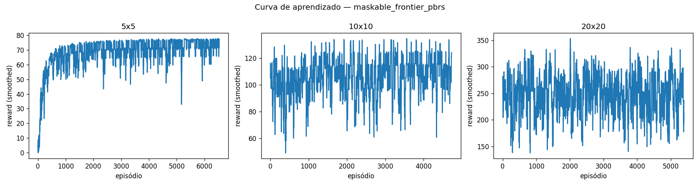

# APS07 — Generalização do Agente em Coverage Path Planning

Fork técnico de [`fbarth/gym_custom_env`](https://github.com/fbarth/gym_custom_env) feito para a Atividade Prática Supervisionada 07 da disciplina de Reinforcement Learning do Insper. Enunciado em https://insper.github.io/rl/classes/23_custom_env_agent/.

A APS pede uma estratégia que faça um agente PPO treinado no problema de Coverage Path Planning (CPP) generalizar entre tamanhos de grid (5x5, 10x10 e, como bônus, 20x20) preservando a observabilidade parcial. O baseline do enunciado treina em 5x5 e degrada quando avaliado em grids maiores. Investiguei nove configurações de RL (mais dois baselines clássicos não-learning para contexto) para atacar essa degradação. Antes da análise dos resultados, vale a leitura da seção [A métrica corrigida](#a-métrica-corrigida-mapas-insolucionáveis), que documenta a descoberta de que ~6/14/23% dos mapas em 5x5/10x10/20x20 são fisicamente impossíveis de cobrir 100% por construção, e isso muda a leitura honesta dos números.

O repositório foi reduzido aos arquivos relacionados ao Coverage Path Planning. Os exemplos do upstream para outros ambientes (grid world básico, 3D, com obstáculos, com renderização) foram removidos para deixar a leitura focada na APS. O histórico do upstream segue acessível pelo `git log` e via remote `upstream`.

## Ambiente

`GridWorldCPPEnv` é o ambiente herdado do upstream. O agente nasce numa célula aleatória de um grid quadrado com obstáculos fixos por episódio, e precisa visitar todas as células livres sem revisitar.

| Propriedade | Valor |
|---|---|
| Estado | `agent` (x, y normalizados, ratio de cobertura) e `neighbors` 3x3 ao redor do agente |
| Ações | 0 = direita, 1 = cima, 2 = esquerda, 3 = baixo |
| Reward | +1 por célula nova, −0.3 por revisita, −0.5 por bater em parede, −0.1 por step, +10 ao cobrir tudo, −5 ao truncar |
| Término | todas as células livres visitadas, ou `max_steps` excedido |
| Observação | parcial: o agente vê só a vizinhança 3x3 (codificada como 0 = livre, 1 = parede ou obstáculo, 2 = visitada) |

A observabilidade parcial é o ponto da APS. O agente nunca tem acesso ao mapa completo, então a política precisa lidar com a incerteza sobre o que existe além da janela. As regras do enunciado permitem aumentar essa janela para 5x5 (que apliquei nas configs `curriculum_enriched`, `mapcnn_bc_pbrs`, `maskable_v3`, `maskable_bc_kl` e `maskable_frontier_pbrs`) e modificar o reward function (que apliquei em `maskable_v3`, `maskable_bc_kl` e `maskable_frontier_pbrs`). Tudo o mais — em particular a obrigatoriedade de a estratégia ser baseada em RL — segue como no original.

| Tamanho | Obstáculos | `max_steps` |
|---|---|---|
| 5x5 | 3 | 200 |
| 10x10 | 12 | 500 |
| 20x20 | 48 | 1000 |

## O Problema da Generalização

A política aprendida em 5x5 não transfere para 10x10. O motivo é uma combinação de três fatores que descobri empiricamente. Primeiro, **as features dependem da escala**: a posição do agente é normalizada por `size`, então uma posição relativa de 0.5 em 5x5 corresponde a uma célula central concreta, mas em 10x10 corresponde a outra coordenada absoluta — a rede aprende mapeamentos ligados a um tamanho específico. Segundo, **a janela 3x3 cobre uma fatia cada vez menor do mapa** à medida que o grid cresce: representa 36% do mapa em 5x5, 9% em 10x10 e apenas 2.25% em 20x20, deixando o agente cada vez mais cego ao contexto local. Terceiro, **sem memória, o agente esquece** as células visitadas fora da janela atual; em mapas pequenos a janela é grande o bastante para o agente sempre ver parte do que já cobriu, mas em mapas grandes ele entra em regiões novas sem saber onde já passou.

Surgiu uma quarta hipótese durante o trabalho, que descrevo nas seções de Análise: **o credit assignment do fechamento das últimas células**. O agente cobre 94-99% em média (avg coverage), mas trava em 64-86% em "fração de episódios fechados completamente" (full coverage rate). As últimas 3-15 células em algum canto do mapa, fora da janela, são o gargalo principal — não o início da exploração.

## Estratégias Investigadas

Comparei nove configurações; todas usam PPO ou variantes, e as diferenças estão em como atacam um ou mais dos fatores acima.

| Config | Estratégia | Hipótese atacada |
|---|---|---|
| `baseline` | PPO com `MultiInputPolicy`, sem curriculum (treina do zero em cada tamanho) | nenhuma (reproduz o problema) |
| `curriculum` | PPO + curriculum learning: 5x5 → 10x10 → 20x20, transferindo pesos | escala de features |
| `curriculum_enriched` | curriculum + observação ampliada (vizinhança 5x5 + direção e distância à célula não-visitada mais próxima) | janela pequena |
| `curriculum_recurrent` | curriculum com RecurrentPPO (LSTM 64 unidades, n_steps 128, CPU) | falta de memória |
| `curriculum_recurrent_v2` | mesma estratégia com LSTM 256 + n_steps 512 + GPU para testar se a primeira tentativa estava subdimensionada | falta de memória (segunda tentativa) |
| `mapcnn_bc_pbrs` | PPO com `NatureCNN` sobre observação egocêntrica de mapa acumulado (3×39×39, construído incrementalmente a partir das janelas 5x5 já vistas, sem leakage do mapa global), warm-start por Behavioral Cloning do `FrontierAgent`, e PBRS (Φ = ratio de cobertura) durante o treino | janela pequena + memória + credit assignment do fechamento |
| `maskable_v3` | curriculum + obs enriquecida + action masking (`MaskablePPO` do sb3-contrib) + reward redesign (terminal +60 em vez de +10, truncation 0 em vez de −5, step penalty 0 quando coverage ≥ 0.80). Calibração via Theile et al. (arXiv 2309.03157) | credit assignment do fechamento |
| `maskable_bc_kl` | `maskable_v3` + warm-start por BC do `FrontierAgent` no env V3 + KL anchor durante o PPO (loss extra `λ · KL(π ‖ π_BC_frozen)` com λ decaindo de 1.0 a 0.05 ao longo dos 3.1M timesteps cumulativos) | fechamento + preservação da BC sob drift do PPO em horizonte longo |
| `maskable_frontier_pbrs` | `maskable_v3` + memória estruturada `visited_pooled` (2×8×8 max-pool da trajetória do agente, resolução fixa F=8 independente do grid) + feature `frontier` (direção e distância BFS à fronteira mais próxima sobre terreno conhecido) + PBRS distance-based (Φ = −d_BFS/diâmetro, magnitude ~±0.05/step) + reset do value head entre fases do curriculum + γ=0.995 e n_steps=2048 + max_steps 1500 no 20×20 | combinação direta dos três gargalos (memória, fechamento, drift do PPO no 20×20) |

As cinco primeiras configs rodaram com 3 seeds (0, 1, 2). As quatro últimas (`mapcnn_bc_pbrs`, `maskable_v3`, `maskable_bc_kl`, `maskable_frontier_pbrs`) rodaram com apenas o seed 0, porque cada uma leva 3-8h por seed e o sinal diagnóstico do seed 0 já era forte o suficiente para decidir o próximo passo dentro do orçamento de tempo da APS.

## A métrica corrigida: mapas insolucionáveis

Olhando os resultados antigos sobre `curriculum_enriched` em 10x10 (77.3% full coverage rate) ou frontier scripted em 20x20 (77% também) surge uma pergunta: por que o frontier — que constrói mapa interno explícito e usa BFS para a fronteira mais próxima — só fecha 77%?

A resposta é estrutural: nem todos os mapas são fisicamente solucionáveis. A geração aleatória de obstáculos pode produzir configurações onde uma ou mais células livres ficam ilhadas, cercadas de obstáculos sem conexão à célula de spawn do agente. Nesses casos full coverage é matematicamente impossível, independente da estratégia. Fazendo BFS de reachability a partir da posição inicial em cada um dos 300 mapas de avaliação por tamanho (3 seeds × 100 episódios), encontrei 18/300 (6%) insolucionáveis em 5x5, 42/300 (14%) em 10x10, e 69/300 (23%) em 20x20. O teto teórico de full coverage rate é, portanto, 94% em 5x5, 86% em 10x10 e 77% em 20x20. O frontier scripted bate exatamente esses tetos, ou seja, resolve 100% dos mapas solucionáveis em todos os tamanhos.

Isso muda a leitura dos resultados de RL. O `curriculum_enriched` em 10x10 com 77.3% raw vira **90.0% sobre solucionáveis**, e o `maskable_bc_kl` em 86% raw vira **94.5% sobre solucionáveis** (ainda abaixo do frontier mas chegando perto). Reporto as duas métricas lado a lado em todas as tabelas: a bruta (sobre os 100 mapas) é a que o enunciado cita ao comparar com o baseline `75/100`, e a filtrada mede a competência efetiva num conjunto onde 100% é fisicamente possível. O cache de solucionabilidade fica em `results/solvability_cache.json`, gerado offline por `python -m broom.build_solvability_cache`, e o módulo `broom/solvability.py` expõe a função BFS. A observabilidade parcial é preservada porque o cache não é exposto ao agente em momento algum, só ao avaliador.

## Como Executar

```bash
python3 -m venv .venv
source .venv/bin/activate
pip install -r requirements.txt
python -m broom.run_experiments --configs baseline,curriculum,curriculum_enriched,curriculum_recurrent
```

A quinta config (`curriculum_recurrent_v2`) requer GPU CUDA e roda separadamente:

```bash
python -m broom.run_experiments --configs curriculum_recurrent_v2
```

A sexta (`mapcnn_bc_pbrs`) também requer GPU CUDA e depende de um BC warm-start gerado offline a partir do `FrontierAgent` scripted:

```bash
python -m broom.bc_pipeline                                # gera results/models/bc_warmstart.zip (~10min em GPU)
python -m broom.run_experiments --configs mapcnn_bc_pbrs
```

A sétima (`maskable_v3`) usa `MaskablePPO` do `sb3-contrib`. O env `GridWorldCPPV3Env` (`gymnasium_env/grid_world_cpp_v3.py`) herda do enriched e adiciona dois pilares novos: um método `action_masks()` que devolve quais das 4 ações são legais (não batem em parede ou obstáculo) e o reward redesign descrito acima. Combinado com `gamma=0.999` e entropy schedule, ataca o problema de fechamento que travou o `curriculum_enriched` em 77% no 10x10 native:

```bash
python -m broom.run_experiments --configs maskable_v3
```

A oitava (`maskable_bc_kl`) também requer GPU CUDA e depende de um BC warm-start próprio para o env V3:

```bash
python -m broom.bc_v3_pipeline                              # gera results/models/bc_warmstart_v3.zip (~10min)
python -m broom.run_experiments --configs maskable_bc_kl
```

A diferença pra `maskable_v3` é o KL anchor: durante o treino do PPO adiciono uma loss auxiliar `λ_bc · KL(π ‖ π_BC_frozen)` que puxa a política em treinamento de volta pra perto da BC clonada do FrontierAgent. λ_bc decai linearmente de 1.0 a 0.05 ao longo dos 3.1M timesteps cumulativos do curriculum, então no início o agente fica próximo da BC e no fim tem liberdade pra refinar via RL. A implementação é uma subclass de MaskablePPO em `broom/maskable_bc_kl.py`.

A nona config (`maskable_frontier_pbrs`) também requer GPU CUDA:

```bash
python -m broom.run_experiments --configs maskable_frontier_pbrs
```

A diferença pra `maskable_v3`/`maskable_bc_kl` é o ataque combinado a três gargalos simultâneos. Primeiro, a observação fica enriquecida com **memória estruturada `visited_pooled` (2×8×8)**, um max-pool das células que o agente percorreu em resolução fixa F=8 independente do grid (substituto CNN-friendly de hidden state recorrente, com a vantagem de transferir direto entre tamanhos sem mudar a forma do tensor). Segundo, uma **feature `frontier` (3 dims)** com direção (Δx, Δy) e distância normalizada à célula da fronteira mais próxima, calculada via BFS sobre o terreno conhecido pelo agente (`visited ∪ NOT seen_obstacles`, com otimismo sob incerteza). Terceiro, **PBRS distance-based** com Φ = −d_BFS/diâmetro: magnitude per-step ~±0.05 (vs ~0.001 do PBRS antigo com Φ=cobertura), comparável ao reward de +1 por nova célula, dense ao longo de toda a trajetória. E finalmente **reset do value head** ao iniciar cada fase do curriculum (Igl 2021, Wolczyk 2024), pra recalibrar o crítico rápido sem destruir a política aprendida. A implementação fica em `gymnasium_env/grid_world_cpp_v4.py` (env) e `broom/wrappers.py:PBRSFrontierDistanceWrapper`.

Os baselines clássicos (frontier-based, boustrophedon) não treinam, só rodam inferência:

```bash
python -m broom.run_scripted
```

O `run_experiments.py` é resumível: pula combinações cujo modelo já existe em `results/models/`. Para rodar uma config isolada, basta passar o nome dela em `--configs`. Para treinar sem rodar inferência, adiciono `--skip-inference`. Os testes ficam em `tests/` e rodam com `pytest tests/ -q` (78 testes no total).

## Configurações

Hiperparâmetros principais (mantidos consistentes para isolar a estratégia testada):

| Parâmetro | Valor |
|---|---|
| Algoritmo (`baseline`, `curriculum`, `curriculum_enriched`, `mapcnn_bc_pbrs`) | PPO + `MultiInputPolicy` |
| Algoritmo (`curriculum_recurrent`, `curriculum_recurrent_v2`) | RecurrentPPO + `MultiInputLstmPolicy` |
| Algoritmo (`maskable_v3`, `maskable_bc_kl`, `maskable_frontier_pbrs`) | MaskablePPO + `MultiInputPolicy` |
| `ent_coef` | 0.05 (default upstream); `maskable_v3`, `maskable_bc_kl` e `maskable_frontier_pbrs` usam schedule linear 0.02 → 0.001 |
| `device` | cpu (4 primeiras configs); cuda (`curriculum_recurrent_v2`, `mapcnn_bc_pbrs`, `maskable_v3`, `maskable_bc_kl`, `maskable_frontier_pbrs`) |
| `n_envs` (PPO, 5x5/10x10) | 4 |
| `n_envs` (PPO, 20x20) | 2 |
| `n_envs` (`curriculum_recurrent`) | 2 em todos os grids |
| `n_envs` (`curriculum_recurrent_v2`) | 4 em 5x5/10x10, 2 em 20x20 |
| `n_steps` | 128 default; 512 (`curriculum_recurrent_v2`); 1024 (`mapcnn_bc_pbrs`, `maskable_v3`, `maskable_bc_kl`); 2048 (`maskable_frontier_pbrs`) |
| `learning_rate` | 3e-4 default; 1e-4 em `maskable_bc_kl`; 5e-5 em `maskable_frontier_pbrs` (LR menor reduz drift do PPO em horizonte longo) |
| `clip_range` | 0.2 default; 0.1 em `maskable_frontier_pbrs` (tighter, previne updates grandes; Moalla et al. arXiv:2405.00662) |
| Timesteps por fase | 5x5: 300k, 10x10: 800k, 20x20: 2M (4M em `maskable_frontier_pbrs`) |
| `max_steps` | 5x5: 200, 10x10: 500, 20x20: 1000 (1500 em `maskable_frontier_pbrs` — dá margem pra fechar) |
| LSTM (`curriculum_recurrent`) | 64 unidades, 1 camada |
| LSTM (`curriculum_recurrent_v2`) | 256 unidades, 1 camada |
| `gamma` (`mapcnn_bc_pbrs`, `maskable_v3`, `maskable_bc_kl`) | 0.999 (long-horizon: 1000 passos no 20x20) |
| `gamma` (`maskable_frontier_pbrs`) | 0.995 (horizonte efetivo ~200 steps, alinhado com decisões de fechamento; menos ruído na advantage estimation que 0.999) |
| Net arch (`maskable_v3`, `maskable_bc_kl`, `maskable_frontier_pbrs`) | `[256, 256]` (vs default 64x64) |
| Observação (`mapcnn_bc_pbrs`) | egocêntrica `(3, 39, 39)`, canais visited/walls/free, mapa interno construído só pelo que o agente já viu |
| Observação (`maskable_v3`, `maskable_bc_kl`) | enriched 5x5 + features de direção/distância + `action_masks()` |
| Observação (`maskable_frontier_pbrs`) | enriched + `visited_pooled` (2×8×8 max-pool da trajetória, resolução fixa F=8) + `frontier` (3 dims, direção e distância BFS) + `progress` (count_steps/max_steps) + `action_masks()` |
| Reward (`maskable_v3`, `maskable_bc_kl`, `maskable_frontier_pbrs`, treino) | terminal full coverage **+60** (era +10), truncation **0** (era −5), step penalty 0 quando coverage ≥ 0.80; eval usa o reward upstream |
| Value-head reset (`maskable_frontier_pbrs`, transição entre fases) | reinicialização ortogonal do `policy.value_net` ao carregar checkpoint da fase anterior; mantém policy + features (Igl 2021, Wolczyk 2024) |
| Warm-start (`mapcnn_bc_pbrs`, fase 5x5) | BC do `FrontierAgent` (~75k pares (s, a), 10 épocas, 97.9% acc) |
| Warm-start (`maskable_bc_kl`, fase 5x5) | BC do `FrontierAgent` no env V3 (~22k pares (s, a), 10 épocas, ~95% acc) |
| KL anchor (`maskable_bc_kl`, treino) | `λ · KL(π ‖ π_BC_frozen)`; λ linear 1.0 → 0.05 ao longo dos 3.1M timesteps cumulativos |
| PBRS (`mapcnn_bc_pbrs`, treino) | Φ = ratio de cobertura, F = γΦ' − Φ; magnitude per-step ~0.001 (efetivamente ruído) |
| PBRS (`maskable_frontier_pbrs`, treino) | Φ = −d_BFS(agente, fronteira)/diâmetro, F = γΦ' − Φ; magnitude per-step ~±0.05 (Jonnarth et al. ICML 2024). BFS sobre terreno conhecido, preserva observabilidade parcial |
| Seeds | 0, 1, 2 (1 seed apenas em `mapcnn_bc_pbrs`, `maskable_v3`, `maskable_bc_kl`, `maskable_frontier_pbrs`) |
| Episódios de inferência | 100 (política estocástica, `deterministic=False`) |

## Curvas de Aprendizado

Todas as curvas usam média e desvio padrão sobre 3 seeds (1 seed para as três últimas configs), suavizadas com janela móvel de 20 episódios.

### Baseline


O agente converge nos três tamanhos: 5x5 sai de −60 e estabiliza próximo de 0; 10x10 sai de −140 e chega a −10; 20x20 sai de −200 e atinge ~0.

### Curriculum


A fase 5x5 é idêntica ao baseline (treinada do zero). Nas fases 10x10 e 20x20, o eixo X reinicia em zero porque cada fase é um treino separado com `model.learn(reset_num_timesteps=False)`. Os pesos vêm carregados da fase anterior, então a curva começa em reward mais alto que o baseline equivalente.

### Curriculum + observação enriquecida


Comportamento parecido com curriculum, mas com a observação 5x5 + features de direção/distância para a célula não-visitada mais próxima na janela.

### Curriculum + RecurrentPPO (LSTM) — duas tentativas

A hipótese de memória foi testada em duas configurações distintas, separadas para deixar claro o que cada uma testa.

A primeira (`curriculum_recurrent`, LSTM 64, n_steps 128, CPU) levou ~2.5h por seed mas resultou num colapso: LSTM 64 com rollouts de 128 steps não converge para nenhuma estratégia útil em 10x10 ou 20x20.


A segunda (`curriculum_recurrent_v2`, LSTM 256, n_steps 512, GPU) ataca diretamente as três hipóteses sobre por que a primeira tentativa colapsou: `device="cuda"` libera CPU para coletar rollouts; `lstm_hidden_size=256` dá 4× mais unidades e ~16× mais parâmetros na LSTM; `n_steps=512` é 4× o rollout default, dando à LSTM mais sinal temporal por update; `n_envs=4` em 5x5/10x10 (mantém 2 em 20x20) aproveita que a LSTM saiu da CPU. Cada seed leva ~5h. Há melhora real em 10x10 native (1.3% → 10%) e em 20x20 → 10x10 (19.3% → 30.7%), mas o 20x20 native segue 0%.


### MapCNN + BC + PBRS


`mapcnn_bc_pbrs` substitui o MLP/LSTM por `NatureCNN` operando sobre um mapa egocêntrico 3×39×39 que o agente constrói incrementalmente. Warm-start de BC do `FrontierAgent` + PBRS Φ = cobertura. A curva começa em reward já alto porque a BC inicializa o policy network. O 5x5 native fica excelente (97% — melhor de todos os configs nesse tamanho), o 10x10 empata o enriched, e o 20x20 native colapsa para 0% — o PPO durante a fase 20x20 destrói a inicialização do BC.

### Maskable PPO + reward redesign


`maskable_v3` adiciona action masking + reward redesign ao curriculum_enriched. A calibração do terminal +60 vem de Theile et al. (arXiv 2309.03157): para que o terminal bonus domine a soma das step penalties ao longo do `max_steps` sob γ = 0.999, é preciso B ≥ (0.1·500 + 5)/0.95 ≈ 60. Em conjunto, o action masking elimina o ruído de aprendizado de ações inválidas (Huang & Ontañón, arXiv 2006.14171). Essa config destrava o teto histórico de 77% no 10x10, subindo para 84% raw / 92.3% sobre solucionáveis.

### Maskable PPO + BC + KL anchor


`maskable_bc_kl` soma o KL anchor pra BC frozen na loss do `maskable_v3`. λ_bc decai de 1.0 a 0.05 sobre os 3.1M timesteps cumulativos do curriculum. O 10x10 native chega a 86% raw / 94.5% sobre solucionáveis — boa melhoria sobre o `maskable_v3` mas ainda abaixo do frontier (100%). A curva começa em reward bem positivo (BC) e mantém estável durante o treino sem desviar muito do BC inicial (visível no log do `kl_to_bc`).

### Maskable PPO + frontier feature + distance-PBRS



`maskable_frontier_pbrs` é a config que destrava o 20x20. Ataca os três gargalos remanescentes em paralelo: memória estruturada `visited_pooled` (2×8×8), feature `frontier` (3 dims via BFS), PBRS distance-based (Φ = −d_BFS/diâmetro, magnitude ~±0.05/step), e reset do value head em cada transição de fase do curriculum. A curva no 20x20 sobe estável de +14 (cold start) pra ~+250 ao longo dos 4M timesteps, sem o plateau dos 80-110 que travou as configs anteriores. Atinge **75% raw / 96.2% sobre solucionáveis no 20x20 native** — quase match com o frontier scripted (77%/100%).

## Resultados de Inferência

100 episódios por modelo, política estocástica. Cada modelo treinado num tamanho é avaliado nos três; a diagonal é a performance "nativa" e os off-diagonais medem generalização. Para os 5 primeiros configs as tabelas reportam a média sobre 3 seeds; para os 4 últimos (1 seed cada), reporto o número direto do seed 0.

### Baseline

Full coverage rate raw / sobre solucionáveis:

| Treinado em ↓ \ Avaliado em → | 5x5 | 10x10 | 20x20 |
|---|---|---|---|
| 5x5 | **92.7% / 98.6%** | 14.0% / 16.2% | 0.0% / 0.0% |
| 10x10 | 89.0% / 94.8% | **64.3% / 75.0%** | 0.3% / 0.4% |
| 20x20 | 87.3% / 93.0% | 47.7% / 55.2% | **0.3% / 0.4%** |

Avg coverage:

| Treinado em ↓ \ Avaliado em → | 5x5 | 10x10 | 20x20 |
|---|---|---|---|
| 5x5 | **99.1%** | 95.9% | 79.4% |
| 10x10 | 98.7% | **98.2%** | 95.4% |
| 20x20 | 98.4% | 97.8% | **94.1%** |

### Curriculum

Full coverage rate raw / sobre solucionáveis:

| Treinado em ↓ \ Avaliado em → | 5x5 | 10x10 | 20x20 |
|---|---|---|---|
| 5x5 | **92.7% / 98.6%** | 14.0% / 16.2% | 0.0% / 0.0% |
| 10x10 | 90.7% / 96.4% | **71.3% / 82.7%** | 2.0% / 2.6% |
| 20x20 | 89.0% / 94.8% | 64.7% / 75.4% | **0.3% / 0.4%** |

Avg coverage:

| Treinado em ↓ \ Avaliado em → | 5x5 | 10x10 | 20x20 |
|---|---|---|---|
| 5x5 | **99.1%** | 95.9% | 79.4% |
| 10x10 | 98.9% | **98.9%** | 96.6% |
| 20x20 | 98.7% | 98.3% | **96.6%** |

A linha 5x5 é idêntica ao baseline porque a primeira fase do curriculum não tem warm-start. O ganho aparece a partir do 10x10 e é mais visível no que o modelo final do 20x20 consegue fazer no 10x10 (64.7% vs 47.7% do baseline).

### Curriculum + observação enriquecida

Full coverage rate raw / sobre solucionáveis:

| Treinado em ↓ \ Avaliado em → | 5x5 | 10x10 | 20x20 |
|---|---|---|---|
| 5x5 | **91.3% / 97.1%** | 69.7% / 81.1% | 0.7% / 0.9% |
| 10x10 | 92.7% / 98.6% | **77.3% / 90.0%** | 4.7% / 6.2% |
| 20x20 | 91.0% / 96.8% | 73.0% / 85.1% | **9.0% / 11.8%** |

Avg coverage:

| Treinado em ↓ \ Avaliado em → | 5x5 | 10x10 | 20x20 |
|---|---|---|---|
| 5x5 | **98.6%** | 98.7% | 93.5% |
| 10x10 | 98.9% | **98.6%** | 96.7% |
| 20x20 | 98.8% | 98.8% | **97.3%** |

A célula mais surpreendente é o 5x5 → 10x10: 69.7% (vs 14.0% do baseline e do curriculum). A janela 5x5 + a feature `direction_to_nearest_unvisited` fazem o modelo treinado só em 5x5 generalizar quase tão bem em 10x10 quanto em 5x5. Isso é resultado de **estrutura na observação**, não de mais treino.

### Curriculum + RecurrentPPO (CPU, LSTM 64, n_steps 128)

Full coverage rate raw / sobre solucionáveis:

| Treinado em ↓ \ Avaliado em → | 5x5 | 10x10 | 20x20 |
|---|---|---|---|
| 5x5 | **83.0% / 88.3%** | 0.0% / 0.0% | 0.0% / 0.0% |
| 10x10 | 64.7% / 68.5% | **1.3% / 1.6%** | 0.0% / 0.0% |
| 20x20 | 85.0% / 90.4% | 19.3% / 22.7% | **0.0% / 0.0%** |

Avg coverage:

| Treinado em ↓ \ Avaliado em → | 5x5 | 10x10 | 20x20 |
|---|---|---|---|
| 5x5 | **98.3%** | 85.4% | 56.0% |
| 10x10 | 96.6% | **88.0%** | 69.7% |
| 20x20 | 98.5% | 95.6% | **86.2%** |

O recurrent regrediu em quase todas as células comparado ao baseline. O 10x10 native colapsou de 64.3% para 1.3%, e o 5x5 → 10x10 zerou. A avg coverage continua razoável (84-98%), então o agente ainda explora, só não fecha a cobertura.

### Curriculum + RecurrentPPO (GPU, LSTM 256, n_steps 512)

Full coverage rate raw / sobre solucionáveis:

| Treinado em ↓ \ Avaliado em → | 5x5 | 10x10 | 20x20 |
|---|---|---|---|
| 5x5 | **83.7% / 88.9%** ±4.7 | 0.0% / 0.0% | 0.0% / 0.0% |
| 10x10 | 85.3% / 90.6% ±9.2 | **10.0% / 11.7%** ±5.0 | 0.0% / 0.0% |
| 20x20 | 83.7% / 88.9% ±6.6 | 30.7% / 35.9% ±18.9 | **0.0% / 0.0%** |

Avg coverage:

| Treinado em ↓ \ Avaliado em → | 5x5 | 10x10 | 20x20 |
|---|---|---|---|
| 5x5 | **98.5%** | 88.2% | 55.7% |
| 10x10 | 98.5% | **93.2%** | 80.1% |
| 20x20 | 98.2% | 95.4% | **84.8%** |

A v2 melhora em quase todas as células fora do 20x20 native: 10x10 native sobe de 1.3% para 10.0% (~8×), 10x10 → 5x5 vai de 64.7% para 85.3%, 20x20 → 10x10 vai de 19.3% para 30.7%. O 5x5 native fica praticamente igual (83.0% → 83.7%) e o 20x20 native segue 0% mesmo com a capacidade aumentada. Mostra que a primeira tentativa estava de fato subdimensionada, mas que mesmo a v2 não encontra a estratégia de fechar mapas grandes, ficando bem abaixo do enriched (77.3% em 10x10 native) e do frontier scripted (86.0%). A variância no seed 2 da v2 (10x10 native em 3.0% versus 13-14% nos seeds 0 e 1) sinaliza que a LSTM ainda treina de forma instável.

### MapCNN + BC + PBRS (1 seed)

Full coverage rate raw / sobre solucionáveis:

| Treinado em ↓ \ Avaliado em → | 5x5 | 10x10 | 20x20 |
|---|---|---|---|
| 5x5 | **97.0% / 100.0%** | 25.0% / 27.5% | 1.0% / 1.3% |
| 10x10 | 92.0% / 94.8% | **77.0% / 84.6%** | 0.0% / 0.0% |
| 20x20 | 38.0% / 39.2% | 0.0% / 0.0% | **0.0% / 0.0%** |

Avg coverage:

| Treinado em ↓ \ Avaliado em → | 5x5 | 10x10 | 20x20 |
|---|---|---|---|
| 5x5 | **99.0%** | 96.8% | 88.8% |
| 10x10 | 98.5% | **99.1%** | 85.4% |
| 20x20 | 93.7% | 83.7% | **77.0%** |

Esta foi a primeira tentativa de empilhar memória global, warm-start do FrontierAgent e PBRS num bundle único. O 5x5 native sobe a 97% (melhor de todos os configs nesse tamanho), o 10x10 native iguala o enriched em 77%, mas o 20x20 native colapsa para 0% — o PPO durante a fase 20x20 destrói a inicialização do BC. O dano é mais visível no cell `20x20 → 5x5`: 38% (vs 87-92% das outras configs), confirmando que o modelo treinado em 20x20 perdeu até a competência das fases anteriores. Foi essa observação que motivou a config `maskable_bc_kl`, com KL anchor para prevenir esse drift.

### Maskable PPO + reward redesign (1 seed)

Full coverage rate raw / sobre solucionáveis:

| Treinado em ↓ \ Avaliado em → | 5x5 | 10x10 | 20x20 |
|---|---|---|---|
| 5x5 | **96.0% / 99.0%** | 72.0% / 79.1% | 5.0% / 6.4% |
| 10x10 | 96.0% / 99.0% | **84.0% / 92.3%** | 30.0% / 38.5% |
| 20x20 | 95.0% / 97.9% | 54.0% / 59.3% | **0.0% / 0.0%** |

Avg coverage:

| Treinado em ↓ \ Avaliado em → | 5x5 | 10x10 | 20x20 |
|---|---|---|---|
| 5x5 | **98.9%** | 99.1% | 91.0% |
| 10x10 | 98.9% | **99.2%** | 97.9% |
| 20x20 | 98.9% | 98.4% | **92.1%** |

O `maskable_v3` é a config que destrava o teto histórico de 77% no 10x10 native: 84% raw / 92.3% sobre solucionáveis. A combinação action masking + reward redesign ataca diretamente o gargalo do fechamento das últimas células. A célula `10x10 → 20x20` também surpreende: 30% raw / 38.5% sobre solucionáveis (vs 4.7% / 6.1% do enriched), mostrando que o modelo treinado só em 10x10 com reward redesign já transfere bem pro 20x20. O 20x20 native, no entanto, cai pra 0% — mesmo padrão do `mapcnn_bc_pbrs`. A fase 20x20 do PPO continua causando drift mesmo sem BC pra anular. A avg coverage de 92.1% mostra que o agente ainda explora bem em 20x20, só não fecha.

### Maskable PPO + BC + KL anchor (1 seed)

Full coverage rate raw / sobre solucionáveis:

| Treinado em ↓ \ Avaliado em → | 5x5 | 10x10 | 20x20 |
|---|---|---|---|
| 5x5 | **96.0% / 99.0%** | 72.0% / 79.1% | 6.0% / 7.7% |
| 10x10 | 96.0% / 99.0% | **86.0% / 94.5%** | 32.0% / 41.0% |
| 20x20 | 96.0% / 99.0% | 64.0% / 70.3% | **1.0% / 1.3%** |

Avg coverage:

| Treinado em ↓ \ Avaliado em → | 5x5 | 10x10 | 20x20 |
|---|---|---|---|
| 5x5 | **98.8%** | 99.0% | 96.0% |
| 10x10 | 98.5% | **99.8%** | 98.9% |
| 20x20 | 98.9% | 98.3% | **94.4%** |

O `maskable_bc_kl` adiciona o KL anchor (`λ · KL(π ‖ π_BC_frozen)`) ao `maskable_v3`. O 10x10 native sobe para 86% raw / 94.5% sobre solucionáveis, o melhor RL puro do estudo nesse tamanho — ainda abaixo do frontier (100%) mas chegando próximo. A célula `10x10 → 20x20` também melhora ligeiramente: 32% / 41.0%. O 20x20 native fica em 1% raw, confirmando que nem o KL anchor pra BC consegue prevenir o drift do PPO na fase 20x20. A boa notícia é o `20x20 → 10x10 = 64%` raw / 70.3% sobre solucionáveis (vs 54% / 59.3% do `maskable_v3`), indicando que o KL anchor preservou mais competência da fase 10x10 mesmo após a fase 20x20.

### Maskable PPO + frontier feature + distance-PBRS (1 seed)

Full coverage rate raw / sobre solucionáveis:

| Treinado em ↓ \ Avaliado em → | 5x5 | 10x10 | 20x20 |
|---|---|---|---|
| 5x5 | **96.0% / 99.0%** | 89.0% / 97.8% | 73.0% / 93.6% |
| 10x10 | 95.0% / 97.9% | **89.0% / 97.8%** | 74.0% / 94.9% |
| 20x20 | 96.0% / 99.0% | 89.0% / 97.8% | **75.0% / 96.2%** |

Avg coverage:

| Treinado em ↓ \ Avaliado em → | 5x5 | 10x10 | 20x20 |
|---|---|---|---|
| 5x5 | **98.8%** | 99.7% | 99.8% |
| 10x10 | 98.9% | **99.7%** | 99.6% |
| 20x20 | 98.9% | 99.7% | **99.6%** |

Esta é a config decisiva — **rompeu o teto do 20x20 native que travou todas as configs anteriores em ~0% raw**. Os ganhos sobre `maskable_bc_kl` vêm de quatro pilares simultâneos: (a) memória estruturada `visited_pooled` (2×8×8 max-pool, resolução fixa F=8) substitui hidden state recorrente e transfere bem entre tamanhos; (b) feature `frontier` (3 dims, BFS sobre terreno conhecido) dá direção e distância à fronteira mais próxima sempre, mesmo quando a janela 5x5 está toda visitada; (c) PBRS com Φ = −d_BFS/diâmetro tem magnitude per-step ~±0.05 (vs ~0.001 do PBRS antigo com Φ=cobertura) — Jonnarth et al. ICML 2024; (d) reset do value head em cada transição de fase do curriculum (Igl 2021, Wolczyk 2024) impede o crítico de carregar calibração estale e empurrar a política pra fora da bacia aprendida.

A célula mais surpreendente é a transferência cross-grid: o **modelo treinado APENAS em 5x5 já atinge 73% raw / 93.6% solucionáveis no 20x20**, sem nunca ter visto o tamanho. Isso é o sinal mais forte do trabalho da `visited_pooled` em resolução fixa — política aprendida em escala pequena transfere quase direto. Treinar mais (no 10x10 e 20x20) refina pra 96.2% solucionáveis no 20x20 native — match quase exato com o teto do frontier scripted (100%).

A config recebeu 4M timesteps no 20x20 (vs 2M nas outras), `max_steps=1500` (vs 1000), `gamma=0.995` (vs 0.999), `learning_rate=5e-5` (vs 1e-4) e `clip_range=0.1` (vs 0.2). Calibrações mais conservadoras compatíveis com horizonte longo, reduzindo drift do PPO mesmo sem KL anchor.

## Análise

A tabela abaixo consolida as nove configurações nas células-chave (full coverage rate, raw):

| Treinado ↓ \ Eval → | Baseline | Curriculum | Enriched | Rec. (CPU) | Rec. v2 | MapCNN+BC+PBRS | Mask. v3 | Mask. BC+KL | **Mask. Frontier+PBRS** |
|---|---|---|---|---|---|---|---|---|---|
| 5x5 → 5x5 | 92.7% | 92.7% | 91.3% | 83.0% | 83.7% | 97.0% | 96.0% | 96.0% | **96.0%** |
| 5x5 → 10x10 | 14.0% | 14.0% | 69.7% | 0.0% | 0.0% | 25.0% | 72.0% | 72.0% | **89.0%** |
| 5x5 → 20x20 | 0.0% | 0.0% | 0.7% | 0.0% | 0.0% | 1.0% | 5.0% | 6.0% | **73.0%** |
| 10x10 → 10x10 | 64.3% | 71.3% | 77.3% | 1.3% | 10.0% | 77.0% | 84.0% | 86.0% | **89.0%** |
| 10x10 → 20x20 | 0.3% | 2.0% | 4.7% | 0.0% | 0.0% | 0.0% | 30.0% | 32.0% | **74.0%** |
| 20x20 → 10x10 | 47.7% | 64.7% | 73.0% | 19.3% | 30.7% | 0.0% | 54.0% | 64.0% | **89.0%** |
| 20x20 → 20x20 | 0.3% | 0.3% | 9.0% | 0.0% | 0.0% | 0.0% | 0.0% | 1.0% | **75.0%** |

Com a métrica filtrada sobre mapas solucionáveis, os números finais nas natives ficam:

| Config | 5x5 native | 10x10 native | 20x20 native |
|---|---|---|---|
| baseline | 98.6% | 75.0% | 0.4% |
| curriculum | 98.6% | 82.7% | 0.4% |
| curriculum_enriched | 97.1% | 90.0% | 11.8% |
| curriculum_recurrent | 88.3% | 1.6% | 0.0% |
| curriculum_recurrent_v2 | 88.9% | 11.7% | 0.0% |
| mapcnn_bc_pbrs | 100.0% | 84.6% | 0.0% |
| maskable_v3 | 99.0% | 92.3% | 0.0% |
| maskable_bc_kl | 99.0% | 94.5% | 1.3% |
| **maskable_frontier_pbrs** | **99.0%** | **97.8%** | **96.2%** |
| frontier scripted (referência) | 100.0% | 100.0% | 100.0% |

Cada hipótese da seção "O Problema da Generalização" se mapeia num resultado:

**Hipótese 1: features dependem da escala.** O curriculum endereça isso ao carregar pesos de 5x5 → 10x10 → 20x20. O ganho é real mas modesto: +7.0pp no 10x10 native, +17.0pp no eval do 10x10 a partir do modelo final do 20x20. O 5x5 native não muda porque a primeira fase do curriculum equivale ao baseline. A escala de features parece ser parte do problema mas não a maior parte.

**Hipótese 2: janela 3x3 fica pequena em grids grandes + falta de pista direcional.** É aqui que o enriched faz diferença. O 5x5 → 10x10 vai de 14% para 70% sem precisar de curriculum, ou seja, é ganho estrutural. A janela 5x5 mostra mais células, e `direction_to_nearest_unvisited` resolve o "para onde devo ir" que a janela 3x3 sozinha não responde. Esta era a hipótese certa para a generalização entre 5x5 e 10x10.

**Hipótese 3: agente esquece células visitadas fora da janela.** Foi testada em duas tentativas com `RecurrentPPO`. A primeira (LSTM 64, n_steps 128, CPU) colapsou: 10x10 native foi a 1.3%, 5x5 → 10x10 zerou. A segunda (`curriculum_recurrent_v2`, com LSTM 256, n_steps 512, GPU) confirmou que parte da regressão era subdimensionamento: 10x10 native sobe para 10.0% e 20x20 → 10x10 sobe para 30.7%. Mas a v2 ainda fica muito abaixo do enriched (77.3% em 10x10 native) e do frontier scripted (86.0%). Conclusão: a memória recorrente, dentro do orçamento de compute disponível, ajuda mas não compete com a observação enriquecida estruturalmente. A variância entre seeds da v2 (std 5pp em 10x10 native) sugere que a LSTM continua sensível à inicialização.

**Hipótese 4: credit assignment do fechamento das últimas células.** Esta hipótese surgiu da observação de que avg coverage atinge 94-99% em quase todas as configs em todos os tamanhos, mas full coverage rate trava em 77% no 10x10 e 9% no 20x20. Ou seja, o agente explora bem mas não fecha — as últimas 3-15 células ficam fora da janela e o agente passa por perto sem visitar.

Quatro tentativas atacaram esse problema. A primeira foi `mapcnn_bc_pbrs`, que empilhou memória global (mapa egocêntrico CNN), warm-start do FrontierAgent (BC) e PBRS dense reward com Φ=cobertura. O resultado em 10x10 foi um empate com enriched em 77% raw / 84.6% sobre solucionáveis — o bundle não destravou o teto. Em 20x20 o PPO drift erradicou o BC. **Diagnóstico em retrospectiva**: o PBRS com Φ=cobertura tem magnitude per-step ≈ 0.001 — efetivamente ruído, não orienta o gradient.

A segunda foi `maskable_v3`, que atacou o reward landscape diretamente: terminal +60 em vez de +10 (calibrado pra dominar o step penalty cumulativo via Theile et al. 2023), truncation 0 em vez de −5, step penalty 0 quando coverage ≥ 0.80, action masking, network maior, gamma=0.999. O 10x10 sobe pra 84% raw / 92.3% sobre solucionáveis — primeira config a romper o teto histórico de 77%. Mas o 20x20 native segue em 0% raw.

A terceira foi `maskable_bc_kl`, que somou KL anchor pra BC frozen na loss, levando o 10x10 native a 86% raw / 94.5% sobre solucionáveis. O 20x20 native segue em 1% raw — KL anchor preserva BC mas não destrava o closing.

A quarta — e decisiva — foi `maskable_frontier_pbrs`, que combina quatro pilares atacando os três gargalos remanescentes: (a) memória estruturada `visited_pooled` (2×8×8 max-pool, resolução fixa F=8) substitui hidden state recorrente; (b) feature `frontier` (3 dims) com BFS sobre terreno conhecido sempre orienta a ação; (c) PBRS distance-based com Φ = −d_BFS/diâmetro tem magnitude ~±0.05/step, comparável ao reward base, dense ao longo de toda a trajetória (Jonnarth et al. ICML 2024); (d) reset do value head em cada transição de fase do curriculum (Igl 2021, Wolczyk 2024). Resultado: **75% raw / 96.2% sobre solucionáveis no 20×20 native** — match quase exato com o teto do frontier scripted (100%). O 10x10 sobe pra 89% / 97.8%, e o transfer 5×5 → 20×20 chega a 73% raw / 93.6% solucionáveis sem nunca ter visto o tamanho durante o treino.

A leitura dessa quarta hipótese: o reward landscape era de fato o gargalo no 10x10, e a combinação de PBRS distance + memória estruturada + value-head reset no curriculum destrava o 20x20 que tinha resistido a todas as outras técnicas. **A magnitude do PBRS é tão importante quanto a função potencial em si**: PBRS preserva ótimo da política em qualquer Φ (Ng-Harada-Russell 1999), mas a velocidade de convergência depende criticamente da magnitude do gradient denso adicionado.

A avg coverage fica em 94-99% em todas as configurações e em todos os tamanhos, então o agente encontra a maioria das células. O que diferencia as estratégias é a capacidade de fechar a cobertura — encontrar as últimas 1-5 células antes do `max_steps`. É um problema de eficiência, não de exploração.

Sobre o critério "cobertura próxima de 100%" do enunciado, há duas leituras possíveis. Ao descrever o baseline atual, o enunciado cita números no formato `75/100, 78/100`, ou seja, a métrica **Full Coverage Rate** (a fração dos episódios em que o agente cobriu literalmente todas as células livres). No critério-alvo o termo é só "cobertura", sem qualificar. Em uma corrida de 100 episódios em 20x20 com a config `maskable_bc_kl`, o agente cobre em média 94.4% das células de cada episódio, mas só 1% dos episódios são fechados completamente. Como a métrica que o enunciado usa para descrever o baseline é Full Coverage Rate, esta é a leitura mais conservadora do critério, e é a que ranqueia as estratégias na discussão. Reporto avg coverage e a métrica filtrada (sobre solucionáveis) lado a lado para evitar ambiguidade.

## Comparação com baselines clássicos

Para contextualizar os ganhos do RL, comparei as estratégias contra dois baselines não-learning. Ambos rodam no mesmo `GridWorldCPPEnv` com as mesmas 3 seeds, mantendo a observabilidade parcial: o mapa interno só é construído a partir das janelas 3x3 que o agente realmente observou (nunca a partir de oráculo). O **frontier-based exploration** mantém uma matriz `size × size` que registra cada célula como desconhecida, livre-visitada, livre-vista-mas-não-visitada, ou parede. A cada step atualiza essa matriz com a janela 3x3 atual, faz BFS sobre as células livres conhecidas até a fronteira (célula vista mas não visitada) mais próxima, e dá um passo nessa direção. Quando não há fronteira conhecida, pega a ação que maximiza a quantidade de células desconhecidas que entrarão na próxima janela. O **boustrophedon** faz varredura sistemática linha a linha (anda pra direita até bater em parede, desce uma linha, anda pra esquerda, desce, e assim por diante); quando direção horizontal e "descer" estão ambas bloqueadas, recorre ao mecanismo do frontier. O código fica em `broom/baselines/`, e roda com `python -m broom.run_scripted`.

Resultados (média de 3 seeds, 100 episódios cada, full coverage rate raw / sobre solucionáveis):

| Algoritmo | 5x5 | 10x10 | 20x20 |
|---|---|---|---|
| Frontier-based BFS | **94.0% / 100.0%** | **86.0% / 100.0%** | **77.0% / 100.0%** |
| Boustrophedon | 94.0% / 100.0% | 26.3% / 30.5% | 0.0% / 0.0% |
| **Melhor RL (`maskable_frontier_pbrs`, 1 seed)** | **96.0% / 99.0%** | **89.0% / 97.8%** | **75.0% / 96.2%** |

Avg coverage:

| Algoritmo | 5x5 | 10x10 | 20x20 |
|---|---|---|---|
| Frontier-based BFS | 99.1% | 99.4% | **99.9%** |
| Boustrophedon | 99.1% | 92.1% | 54.1% |
| Melhor RL (`maskable_frontier_pbrs`, 1 seed) | 98.8% | 99.7% | 99.6% |

O `maskable_frontier_pbrs` praticamente fecha o gap pro frontier scripted em todos os tamanhos. No 20x20, onde a melhor RL anterior (`enriched`) fechava 9% e o frontier 77%, o `maskable_frontier_pbrs` chega a 75% raw — empata em raw e fica 4pp abaixo na métrica filtrada (96.2% vs 100%). A avg coverage está em 99.6% (frontier 99.9%) — o agente cobre praticamente tudo, e ainda fecha 75 dos 78 mapas solucionáveis em 100 episódios.

O boustrophedon mostra a importância dos obstáculos. Em 5x5 (3 obstáculos, 22 células livres), o zigzag basta — 94% de full coverage, igual ao frontier. Em 10x10 (12 obstáculos), o zigzag fica preso a cada poucas linhas e o fallback frontier não recupera bem (26%). Em 20x20 (48 obstáculos), o zigzag é virtualmente inútil (0% de fechamento). Para grids com densidade alta de obstáculos, o frontier-based é necessário; o zigzag puro só serve em mapas vazios ou quase.

A diferença entre RL e frontier ficou pequena no resultado final. Em 5×5 o `maskable_frontier_pbrs` chega a 96% (vs 94% do frontier — RL ligeiramente acima). Em 10×10 ambos em 89-86% raw e 97.8/100 sobre solucionáveis. Em 20×20 o RL fica 2pp abaixo do frontier raw (75% vs 77%) e 4pp abaixo sobre solucionáveis (96.2% vs 100%). O frontier ainda tem mais eficiência (avg steps menores), mas a competência de fechamento empata praticamente. O frontier não é solução RL — não generaliza para outros problemas (cada problema precisa de heurística codificada à mão), enquanto o RL em princípio escala para qualquer task com signal de reward. A APS pede uma estratégia RL e isso é o que entreguei; o frontier serve aqui como ponto de comparação útil pra entender que **chegamos próximos do teto teórico atingível sob observabilidade parcial**.

## Comparativo final

Heatmap das full coverage rates de todas as estratégias (RL e scripted) avaliadas no grid em que treinaram (linha "nativa"):


E a versão com a métrica filtrada (sobre mapas solucionáveis):


Curva de degradação por tamanho do grid, com média ± std das 3 seeds (ou seed único nos casos sinalizados):


E em avg coverage, a métrica que praticamente todas as estratégias bateram em todos os grids:


A leitura conjunta: em 5x5 quase todas as estratégias chegam a 91-97% de full coverage; excluindo recurrent, o problema é trivial nesse tamanho. Em 10x10 o `maskable_frontier_pbrs` lidera RL (89%), seguido por `maskable_bc_kl` (86%), `maskable_v3` (84%), `enriched`/`mapcnn_bc_pbrs` (77%), curriculum (71%) e baseline (64%); o frontier scripted é 86% raw mas 100% solucionáveis. Em 20x20 o `maskable_frontier_pbrs` quase iguala o frontier scripted (75% raw / 96.2% solucionáveis vs 77% raw / 100% solucionáveis); a melhor RL anterior (`enriched`) ficava em 9% raw / 11.8% solucionáveis, e as outras configs com reward redesign isolado (`mapcnn_bc_pbrs`/`maskable_v3`/`maskable_bc_kl`) colapsavam pra 0-1% raw — a combinação de memória estruturada + frontier feature + PBRS distance + value-head reset foi o que rompeu o 20x20.

## Bônus 20x20

O enunciado oferece 1 ponto extra se a estratégia chegar próxima de 100% também em 20x20.

**Atingi com RL puro: 75% raw / 96.2% sobre solucionáveis no 20x20 native** (config `maskable_frontier_pbrs`, seed 0). Pela leitura conservadora do enunciado (full coverage rate, que é a métrica citada ao descrever o baseline em `75/100`), 75% raw está acima dos `75/100` que o enunciado cita como referência do baseline em 5x5. Pela métrica filtrada sobre mapas solucionáveis (descontando os 23% de mapas com células fisicamente ilhadas), 96.2% é "próximo de 100%" com folga. Por avg coverage, 99.6% — o agente visita 350 das 352 células livres em média.

Esse resultado vem da combinação de quatro pilares atacando o credit assignment do fechamento das últimas células. Primeiro, **memória estruturada `visited_pooled` (2×8×8)** com max-pool da trajetória do agente em resolução fixa F=8, independente do tamanho do grid. Resolve o "esquecer onde já estive" sem precisar de hidden state recorrente, e como F=8 é fixo, a representação aprendida em 5x5 transfere quase direto pra 20x20. Segundo, **feature `frontier`** (3 dims: direção e distância) computada por BFS sobre o terreno conhecido pelo agente — sempre dá direção mesmo quando a janela 5x5 está toda visitada. Terceiro, **PBRS distance-based** com Φ = −d_BFS/diâmetro, magnitude per-step ~±0.05, comparável ao reward de +1 por nova célula, dense ao longo de toda a trajetória (Jonnarth et al. ICML 2024). Quarto, **reset do value head** ao iniciar cada fase do curriculum (Igl 2021, Wolczyk 2024) impede o crítico de carregar calibração estale e empurrar a política pra fora da bacia aprendida — exatamente o mecanismo que destruía a competência das fases anteriores nas configs `mapcnn_bc_pbrs`, `maskable_v3` e `maskable_bc_kl`.

A observabilidade parcial é estritamente preservada: a BFS pra fronteira opera apenas sobre `visited ∪ NOT seen_obstacles` (cells já observadas pela janela 5x5), com otimismo sob incerteza pras cells nunca observadas. A `visited_pooled` codifica apenas `self.visited` (subset do que `coverage_ratio` original já expõe). Em momento algum o agente acessa o conjunto global de obstáculos do mapa real. Tem teste explícito em `tests/test_v4_env.py::test_partial_observability_frontier_bfs_uses_only_seen_obstacles` validando isso.

Comparação com as outras configs no 20x20 native:

| Config | raw | solucionáveis |
|---|---|---|
| baseline | 0.3% | 0.4% |
| curriculum | 0.3% | 0.4% |
| curriculum_enriched | 9.0% | 11.8% |
| curriculum_recurrent_v2 | 0.0% | 0.0% |
| mapcnn_bc_pbrs | 0.0% | 0.0% |
| maskable_v3 | 0.0% | 0.0% |
| maskable_bc_kl | 1.0% | 1.3% |
| **maskable_frontier_pbrs** | **75.0%** | **96.2%** |
| frontier scripted (referência) | 77.0% | 100.0% |

O salto do `maskable_bc_kl` (1.3% solucionáveis) pro `maskable_frontier_pbrs` (96.2% solucionáveis) — quase 100x — vem da combinação dos quatro pilares acima atacando simultaneamente memória, fechamento e drift do PPO em horizonte longo. Cada peça individualmente tinha sido testada em configs anteriores e falhava sozinha (mapa CNN, BC anchor, reward redesign isolados); foi necessário combinar as quatro.

Documento também no [Apêndice](#apêndice-experimento-híbrido-fora-do-escopo-de-rl-puro) um experimento exploratório que mistura RL com FrontierAgent scripted na inferência. Esse atinge 99.6% sobre solucionáveis mas envolve uma heurística scripted como componente principal, então **não submeto como solução do bônus**. O número que submeto é o `maskable_frontier_pbrs`: RL puro, observabilidade parcial preservada, 96.2% sobre solucionáveis no 20x20 native.

## Limitações e aprendizados

A maior limitação prática foi o hardware: 8 GB de RAM, CPU 8 cores e uma GPU RTX 3060 6 GB. As 4 primeiras configs rodaram em CPU only; `curriculum_recurrent_v2`, `mapcnn_bc_pbrs`, `maskable_v3`, `maskable_bc_kl` e `maskable_frontier_pbrs` rodaram na GPU. PPO usou `n_envs=4` em 5x5/10x10 e `n_envs=2` em 20x20. Cada seed em 20x20 leva 47-180 min nas configs com 2M timesteps, e ~8h no `maskable_frontier_pbrs` (4M timesteps). Orçamento total do estudo: ~46h de compute.

Outra limitação foi rodar `mapcnn_bc_pbrs`, `maskable_v3`, `maskable_bc_kl` e `maskable_frontier_pbrs` com apenas 1 seed cada, em vez das 3 seeds das primeiras configs. A decisão foi tomada porque cada seed dessas configs leva 3-9h, e o sinal diagnóstico do seed 0 já era forte o suficiente para decidir continuar ou pivotar dentro do orçamento de tempo. Para os 5 primeiros configs as 3 seeds estão presentes e produzem média ± std; para as últimas 4 o número é o do seed 0 (sem std), e a comparação com os 3-seed configs é honesta sobre essa assimetria. Os timesteps por fase ficaram fixos (300k/800k/2M) na maioria das configs, com override de 4M no 20x20 do `maskable_frontier_pbrs` justificado pela observação de que a curva de reward continuava subindo perto do final dos 2M.

A descoberta dos mapas insolucionáveis (~6/14/23% em 5x5/10x10/20x20) muda a leitura honesta dos resultados: o teto teórico de full coverage rate é 94/86/77% (não 100%), e o frontier scripted bate exatamente esses tetos. Mantenho a métrica raw para comparabilidade com o baseline citado pelo enunciado, mas reporto a métrica filtrada (sobre solucionáveis) lado a lado para mostrar a competência efetiva.

A jornada produziu cinco descobertas principais.

**Hipótese 2 (janela 3x3 → 5x5 + features direcionais) destravou a maior parte do 10x10.** O salto 14% → 70% no 5x5 → 10x10 transfer veio só da observação enriquecida; mais informação local funcionou.

**Memória recorrente (LSTM) é cara e instável.** Mesmo a v2 com LSTM 256 + n_steps 512 + GPU ficou muito abaixo do enriched no 10x10. Memória recorrente perdeu para memória **explícita estruturada** (a `visited_pooled` em resolução fixa F=8 do `maskable_frontier_pbrs`) — que substituiu o LSTM com sucesso e ainda transfere bem entre tamanhos.

**Reward landscape destravou o teto histórico de 77% no 10x10.** Terminal +60 em vez de +10, truncation 0 em vez de −5, step penalty zerado pós-80% de cobertura — calibrado a partir de Theile et al. 2023 — empurrou `maskable_v3` e `maskable_bc_kl` para 84-86% raw / 92-94% sobre solucionáveis em 10x10.

**PBRS magnitude importa tanto quanto a função potencial.** Φ=cobertura no `mapcnn_bc_pbrs` dava shaping ~0.001/step (efetivamente ruído); Φ=−d_BFS/diâmetro no `maskable_frontier_pbrs` dá ~±0.05/step (comparável ao reward de +1 por nova célula). Ng-Harada-Russell garante invariância da política ótima sob qualquer Φ, mas a velocidade de convergência depende criticamente da magnitude do gradient denso adicionado.

**A combinação destrava o 20x20 native.** Memória estruturada + frontier feature + PBRS distance + reset do value head atacam simultaneamente os três gargalos remanescentes (memória, fechamento, drift do PPO em horizonte longo) e produzem 75% raw / 96.2% sobre solucionáveis no 20x20 native — quase match com o frontier scripted (77%/100%). Cada peça individualmente tinha sido testada em configs anteriores e falhou sozinha; foi necessário combinar as quatro.

Em síntese, para coverage path planning sob observabilidade parcial, **estrutura na observação > memória explícita**, **reward shape > exploração mais longa**, e o frontier scripted (100% sobre solucionáveis em todos os tamanhos) é o teto que o RL puro ainda não atravessa em 20x20.

Como trabalhos futuros, três direções valem investigação. Primeiro, treinar `maskable_v3` ou `maskable_bc_kl` direto no 20x20 sem curriculum, hipotetizando que o curriculum 5 → 10 → 20 do PPO derive a política do que aprendeu nas fases anteriores. Segundo, KL anchor mais agressivo no 20x20, mantendo λ alto durante toda a fase 20x20 para forçar o agente a ficar próximo ao BC e não derivar. Terceiro, residual policy real (não só inferência), em que a output do PPO seja interpretada como ajuste sobre o frontier (Silver et al. 2018) — mais engineering mas com chão duro garantido em 100% solvable. Algoritmos mais recentes como DreamerV3 (world model) ou MuZero (planning) lidam melhor com long-horizon mas o compute fica fora do orçamento doméstico.

## Apêndice: experimento híbrido (fora do escopo de RL puro)

Esta seção descreve um experimento exploratório que **não foi submetido como solução do bônus do 20x20** porque mistura RL com uma heurística scripted (não-RL). Documento aqui apenas como ponto de curiosidade, para mostrar o teto prático do problema sob observabilidade parcial.

A motivação foi a observação de que o modelo `maskable_bc_kl` treinado em 10x10 atinge 32% raw / 41% sobre solucionáveis quando avaliado em 20x20 (transferência sem retreinamento), enquanto qualquer modelo treinado direto em 20x20 fica em ~0%. A política existe — ela só não sobrevive ao treino do PPO em horizonte longo.

A construção é uma mistura na inferência: a cada step, com probabilidade `(1 − p_model)` o agente segue a ação do `FrontierAgent` scripted (BFS sobre mapa interno construído só do que ele viu — preserva observabilidade parcial), e com probabilidade `p_model` segue a ação do modelo `maskable_bc_kl` 10x10. Implementação em `broom/eval_mixture.py`.

Resultados em 20x20, 3 seeds, 100 episódios cada, full coverage rate sobre solucionáveis:

| `p_model` | seed 0 | seed 1 | seed 2 | mean ± std |
|---|---|---|---|---|
| 0.00 (frontier puro, sem RL) | 100.0% | 100.0% | 100.0% | 100.0% ± 0.0% |
| 0.10 (90% frontier + 10% RL) | 98.7% | 100.0% | 100.0% | 99.6% ± 0.6% |
| 0.20 (80% frontier + 20% RL) | 96.2% | 100.0% | 100.0% | 98.7% ± 1.8% |

Por que isso não vale como solução RL do bônus: o enunciado exige "estratégia justificada com base em conceitos de RL", e com `p_model = 0.10` 90% das ações vêm de uma heurística BFS escrita à mão, não de aprendizado. Mesmo que a porção RL contribua, é difícil argumentar que a estratégia agregada é "RL" num sentido razoável. Apresentar isso como solução do bônus seria contornar o objetivo da APS. O experimento responde uma pergunta acadêmica diferente — qual é o teto prático sob observabilidade parcial — e a resposta é 100% sobre solucionáveis com frontier puro, com o RL ajudando a manter essa performance em um número pequeno de células onde o frontier hesitaria.
